# ZAP - Bacia Hidrográfica do Ribeirão Santana

  <b>Autores:</b> 
  <a>Cristiano Christofaro Matosinhos</a> 
  <a>Gleyce Campos Dutra</a> 
  <a>Reynaldo Campos Santana</a> 
  <a>Danielle Piuzana Mucida</a> 
  <a>Marcelino Morais</a> 
  <a>Tamara Kelly Marques Rocha Nunes</a> 
  <a>Eric Bastos Gorgens</a>
    

## Sumário

1. [Introdução](https://github.com/Gorgens/nepzap/blob/master/ribSantana/ribSantana.md#introdu%C3%A7%C3%A3o)
2. [Desenvolvimento](https://github.com/Gorgens/nepzap/blob/master/ribSantana/ribSantana.md#desenvolvimento)
3. [Diagnóstico e análise ambiental da bacia](https://github.com/Gorgens/nepzap/blob/master/ribSantana/ribSantana.md#diagn%C3%B3stico-e-an%C3%A1lise-ambiental-da-bacia)
4. [Considerações gerais](https://github.com/Gorgens/nepzap/blob/master/ribSantana/ribSantana.md#considera%C3%A7%C3%B5es-gerais)

## Introdução

A crescente demanda pelos recursos hídricos faz com que a gestão destes seja cada vez mais aprimorada nas regiões onde a água se encontra em estado de conflito de uso ou escassa. Novas metodologias de caracterização e interpretação de dados são elaboradas para auxiliar na resolução destes conflitos. O Zoneamento Ambiental Produtivo (ZAP) é uma dessas metodologias, aprovada pelo Estado de Minas Gerais em 2014, que tem como objetivo aprimorar a gestão socioambiental e econômica de bacias hidrográficas no Estado de Minas Gerais. O ZAP baseia-se na concepção de três produtos básicos que são interrelacionados de modo a gerar informações importantes para o manejo de bacias hidrográficas. 

Três produtos principais compõem este estudo: (1) caracterização das unidades de paisagem, (2) diagnóstico da disponibilidade hídrica da bacia com base nas outorgas existentes e (3) levantamento do uso e ocupação do solo. Através do cruzamento desses produtos foi possível elaborar um diagnóstico completo sobre o uso dos recursos hídricos e sobre uso e ocupação do solo frente as unidades de paisagem que compõem a bacia.

A bacia do Ribeirão Santana, contemplada neste ZAP, está localizada na região do Alto Jequitinhonha, no município de Felício dos Santos e pertence à Unidade de Planejamento e Gestão de Recursos Hídricos do Rio Araçuaí (UPGRH JQ2). Não há registro de conflitos pelo uso da água na sub bacia do Ribeirão Santana, e a demanda está concentrada na parte baixa da bacia. No entanto, este estudo é peça fundamental no planejamento e gestão do espaço para evitar e mitigar potenciais conflitos. Além da gestão do uso dos recursos hídricos, o ZAP subsidia o planejamento territorial visando a conservação e potencializando a utilização ótima de cada unidade de trabalho. Este relatório apresenta um diagnóstico completo da bacia, incluindo caracterização da paisagem, limitações, potencialidades de uso e conflito. Sendo, portanto, o ponto de partida para a implantação de futuros projetos e desenvolvimento de políticas públicas. A ausência de estudos socioambientais, na área onde se encontra a bacia do Ribeirão Santana, faz com que a aplicação da metodologia ZAP, se torne ainda mais relevante. 

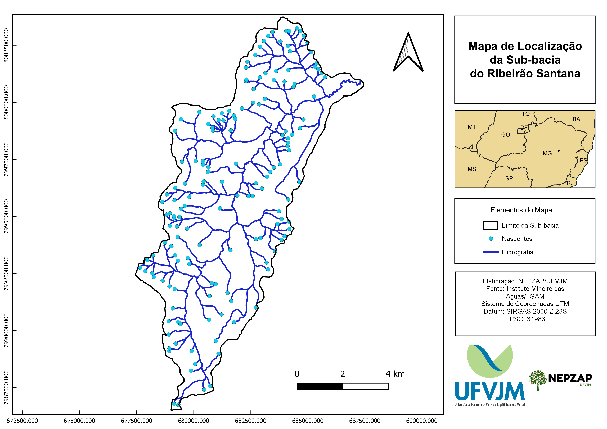

## Desenvolvimento

### Caracterização da bacia

A bacia do Ribeirão Santana está integralmente localizada no município de Felício dos Santos, a 369 km de Belo Horizonte, capital do estado. Com uma área de aproximadamente 7284.12 hectares, se insere na Unidade de Planejamento e Gestão de Recursos Hídricos do rio Araçuaí (UPGRH JQ2). O seu curso principal, Ribeirão Santana, deságua no Rio Araçuaí que, por sua vez, deságua no Rio Jequitinhonha. A área urbana do município de Felício dos Santos conta com cerca de 5.692 habitantes e está localizada na parte baixa da bacia. De acordo com a classificação de Köppen-Geiger, o regime climático na região da bacia é tropical de altitude (Cwb), caracterizado por verões brandos e úmidos e invernos frescos e secos. Os índices de precipitação variam de 1250 mm a 1550 mm e a temperatura média anual não ultrapassa os 20ºC. 

No contexto geológico regional, a bacia do Ribeirão Santana é representado por três unidades: rochas metamórficas do Supergrupo Espinhaço (Grupo Diamantina) na porção alta da bacia, rochas metamórficas do Supergrupo São Francisco (grupo Macaúbas) na porção média da bacia e rochas ígnicas da unidade Granitóide Rio Itanguá. Por conta desta diversidade de substratos, a vegetação apresenta uma fisionomia diversifidada de campos rupestres a trechos de floreta semidecidual. Na porção sob influência do supergrupo Espinhaço, destacam-se os litotipos de metaconglomerados, quartzito e metapelito. Na porção do supergrupo São Francisco, destacam-se os litotipos metadiamictito, quartzito ferruginoso, grafita xisto e metapelito. Por fim, na porção Granitóide Rio Itanguá, destaca-se o litotipo granito.

Os solos identificados na bacia são representados pelas classes dos cambissolo háplico, argissolo vermelho-amarelo, neossolo litólico e latossolo vermelho. O cambissolos háplico predomina na área da bacia, sendo ocupado principalmente por vegetação nativa e pastagem. No argissolo vermelho-amarelo predomina a ocupação urbana, pastagem e vegetação nativa. No neossolo litólico observa-se principalmente afloramantos rochosos e vegetação nativa, enquanto que no latossolo vermelho predomina a atividade silvicultural.

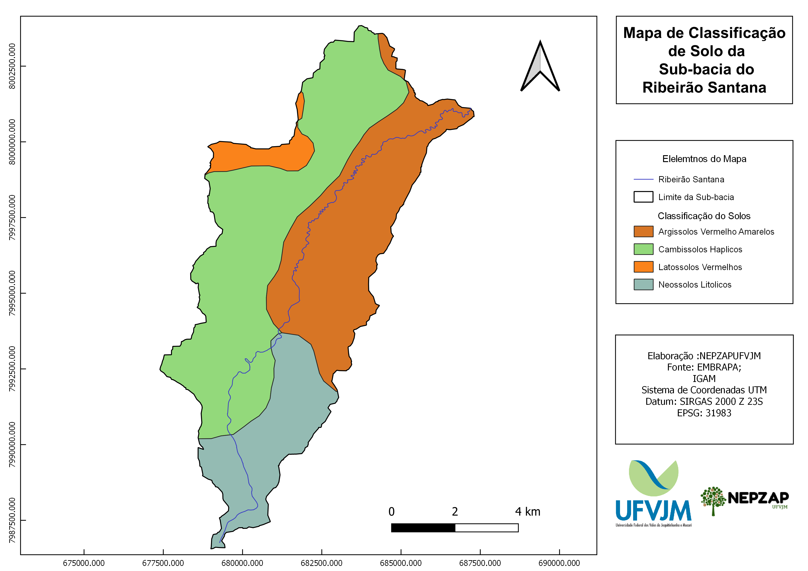

A bacia está localizada na Serra do Espinhaço e apresenta um relevo suave ondulado na porção baixa da bacia a ondulado a montanhoso na porção alta da bacia. A elevação varia de 1826 metros na cabeceira bacia, até 709 metros no encontro com o Rio Araçuaí. A declividade predominante está entre valores 0 e 8%, no entanto a porções da bacia com declividade atingindo 45%. O alto e médio da bacia está dentro de uma área de proteção ambiental denominada APA Municipal Felício dos Santos, instituído pela lei 502 de 27/03/03.

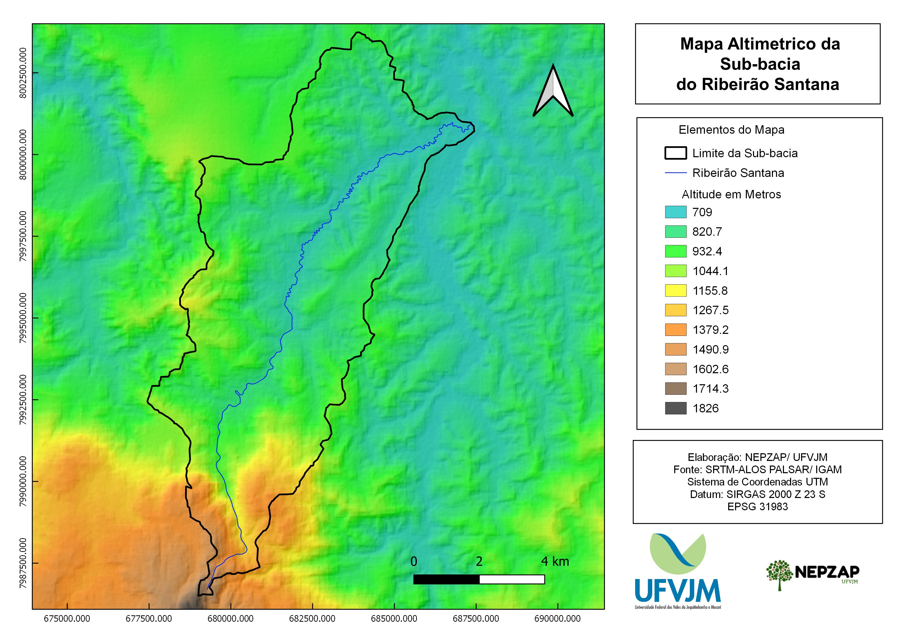

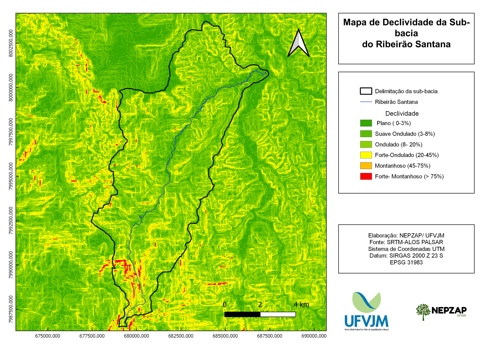

### Bases de dados

Este estudo foi realizado a partir de pesquisas bibliográficas, visita de campo, softwares de geoprocessamento, processamento de imagens de satélite e dados oficiais de órgãos federais e estaduais. Enumerando:

- Software QGIS vesão 3.10 e plugins;
- Software Google Earth Pro 7.3.2.5491, 64-bits;
- Software Google Earth Engine;
- Imagens Sentinel-2 e SRTM Global DEM;
- Shapefile de drenagem da bacia do Rio São Francisco com escala de 1:100.000, obtido através da IDE-Sisema (Infraestrutura de Dados Espaciais do Sistema Estadual de Meio Ambiente e Recursos Hídricos);
- Shapefile de ottobacias da bacia do Rio São Francisco, obtido no IDE-Sisema;
- Shapefile dos municípios do Estado de Minas Gerais, obtido no IDE-Sisema;
- Shapefile de Declaração de Áreas de Conflito (DAC) obtido no IDE-Sisema;
- Shapefile de Unidades de Conservação obtido através da IDE-Sisema; 
- Mapa geológico do Estado de Minas Gerais na escala de 1:100.000 da CODEMIG versão 2014;
- Mapa de classes de solos do Brasil na escala de 1:5.000.000 da EMBRAPA/RADAM;
- Relatório dos usuários de água e de Hidrografia da bacia do Ribeirão Santana obtido junto a SEMAD.

### Unidades de paisagem

As unidades de paisagem são inicialmente traçadas a partir dos mapas de solo, litologia, modelo digital de elevação e declividade. Em seguida, as unidades são validadas por meio de visitam em campo. A unidade de paisagem leva em consideração a especificidade local e seus componentes físicos (geologia, relevo e solos), bióticos (vegetação nativa) e socioeconômicos (atividades antrópicas). As unidades de paisagem foram identificadas preliminarmente cruzando as curvas de nível derivadas do modelo digital de elevação do SRTM e as imagens do Google Earth Pro. A interpretação da paisagem foi feita a partir da visualização 3D, com exagero vertical de 1,5. A caracterização de cada Unidade de Paisagem leva em consideração a morfologia, o embasamento geológico/pedológico, cobertura vegetal nativa original, uso atual e situação ambiental. Em seguida, por meio de visita a campo, a interpretação preliminar é refinada. A análise foi finalizada com a identificação, para cada unidade de paisagem, das potencialidades, limitações, fragilidades e aptidões para fins múltiplos.

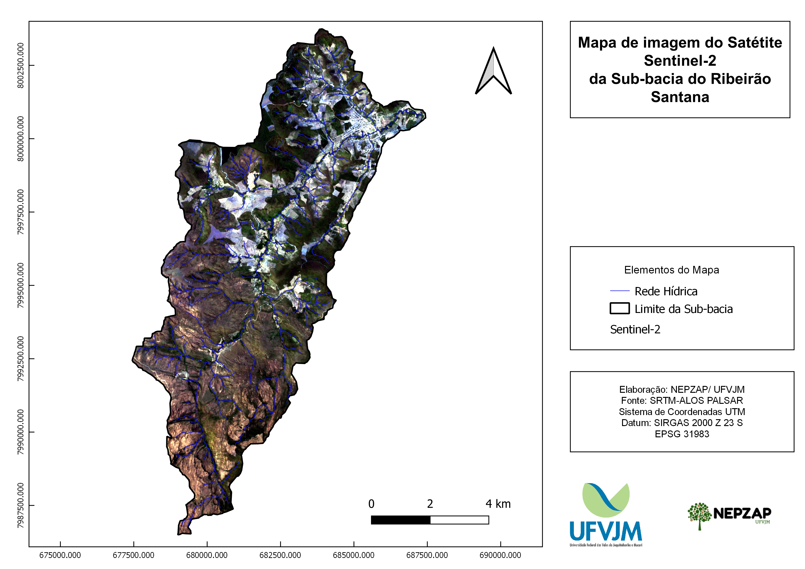

### Disponibilidade hidrica

O diagnóstico da disponibilidade hídrica se baseia nos dados de outorgas disponibilizados pelo Instituto Mineiro de Gestão das Águas (IGAM) e pela Secretaria de Estado de Meio Ambiente e Desenvolvimento Sustentável de Minas Gerais (SEMAD). Foi determinado o código indentificador do curso d’água principal da bacia, no caso, Ribeirão Santama, com a base ottocodificada do IGAM. A hidrografia com os dados de regionalização de vazão para os cálculos necessários ao diagnóstico foi obtida no IDE-Sisema e as informações de outorgas e cadastro de uso insignificante solicitadas à SEMAD, nos termos do anexo III da metodologia ZAP.

Após a delimitação da bacia e de sua hidrografia, os dados de outorga e cadastro de uso insignificante foram consistidos e plotados seguindo a metodologia ZAP. Apenas usuários de água superficial são contemplados neste estudo de disponibilidade hídrica. Todos os usuários que apresentam status de “Cadastro Efetivado”, “Outorga Deferida, Renovada e Retificada” e processos com vencimento posterior a março de 2018 foram incluídos.

Após a consolidação da camada, os cálculos para todos os subprodutos da disponibilidade hídrica foram computados e os mapas finais elaborados. Os cálculos incluiram a disponibilidade hídrica de cada trecho e o comprometimento hídrico de cada trecho. A situação da disponibilidade hídrica foi classificada de acordo com o comprometimento de cada segmento em 'indisponível', 'estado de atenção' e 'disponível'.

### Uso e ocupação do solo

O mapeamento do uso e ocupação do solo foi elaborado a partir do processamento de imagens de satélite, vetorização manual e observações em campo. O mapeamento foi realizado em duas etapas. Na primeira, as bandas 2, 3, 4 e 8 do Sentinel-2 com resolução espacial de 10 metros foram classificadas em 4 grupos de forma automatizada usando metodologia classificação supervisionada. No segundo momento, a classificação foi refinada utilizando as ferramentas de digitalização avançada do QGis e as imagens do Google Satélite para refinar a interpretação visual das feições. Foram considerandos os seguintes usos do solo:

- Agricultura
- Pastagem
- Vegetação nativa
- Solo exposto
- Benfeitorias
- Represas / Água
- Afloramento rochoso
- Floresta plantada (silvicultura)
- Área urbana

A bacia apresenta inúmeros represamentos, de área inferior a 1 hectare, espalhados por toda a área. Na região central, observa-se um agrupamento de represamentos, provavelmente relacionados à psicultura. Para efeito de uso do solo eles foram vetorizados em conjunto, mas não foram considerados para desenho da área de preservação permanente, por se tratarem, na prática, de múltiplos pequenos reservatórios.

## Diagnóstico e análise ambiental da bacia

### Descrição técnica das observações de campo

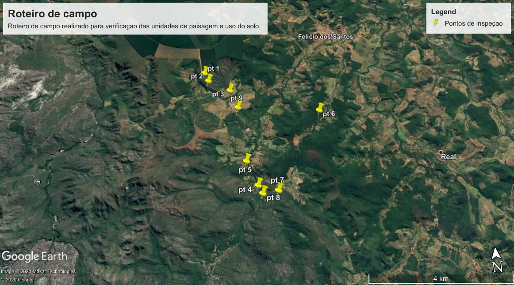

#### Ponto 1

Descrição: Rebordo da chapada com vistas para o curso do Ribeirão Santana, iniciando com vista para sul, sudeste e leste.

Solo Predominante:

Uso e ocupação atual: Vegetação nativa, com alguns pontos de pastagem.

Situação ambiental:

Imagens:

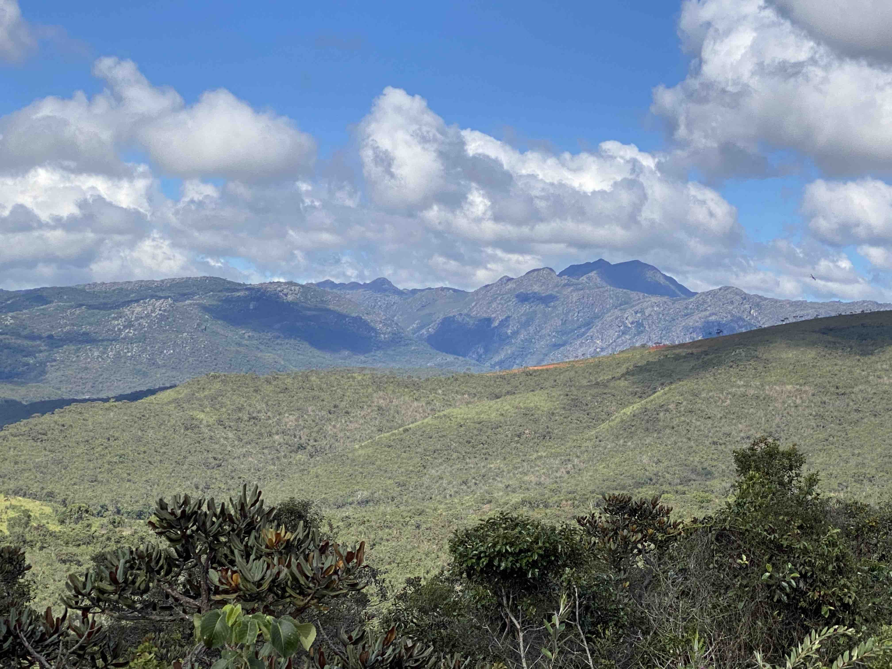

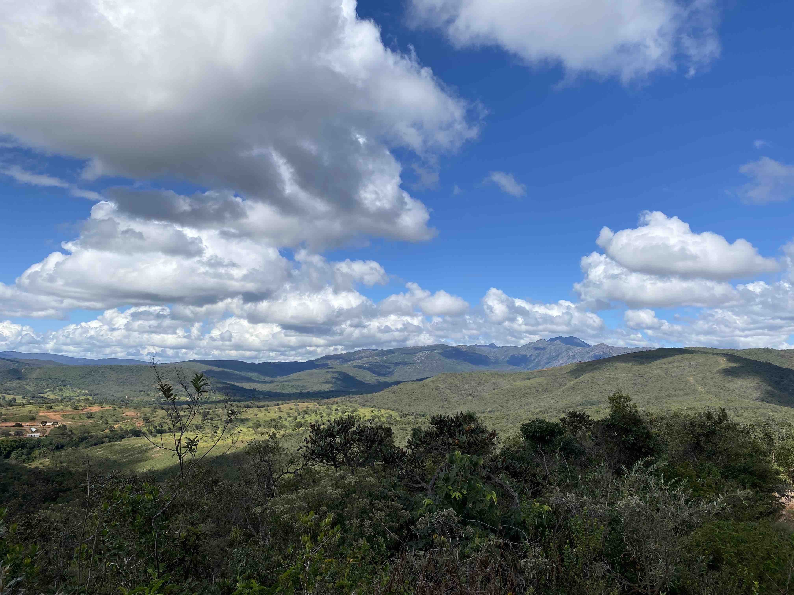

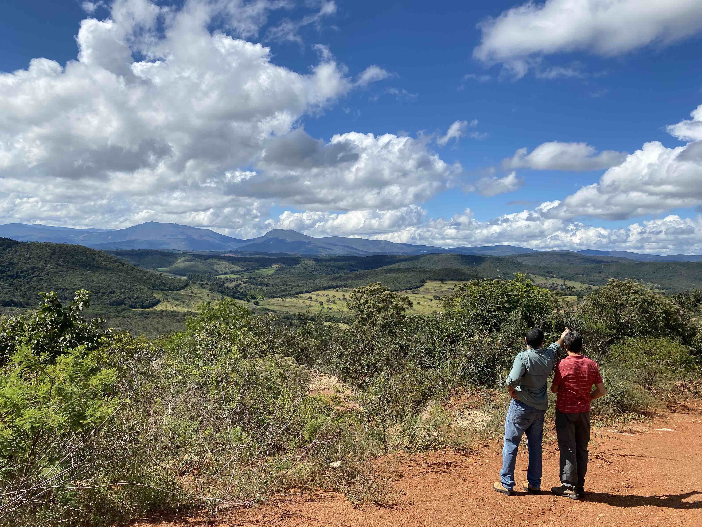

#### Ponto 2

Descrição: Comunidade rural denominada Canjica.

Solo Predominante:

Uso e ocupação atual: Pastagem a agricultura

Situação ambiental:

Imagens:

#### Ponto 3

Descrição: Vertente ravinada com vista para o tabuleiro com plantios de eucalipto.

Solo Predominante:

Uso e ocupação atual: Vegetação nativa na vertente com plantios de eucalipto no tabuleiro.

Situação ambiental:

Imagens:

#### Ponto 4

Descrição: 

Solo Predominante:

Uso e ocupação atual:

Situação ambiental:

Imagens:

#### Ponto 5

Descrição: 

Solo Predominante:

Uso e ocupação atual:

Situação ambiental:

Imagens:

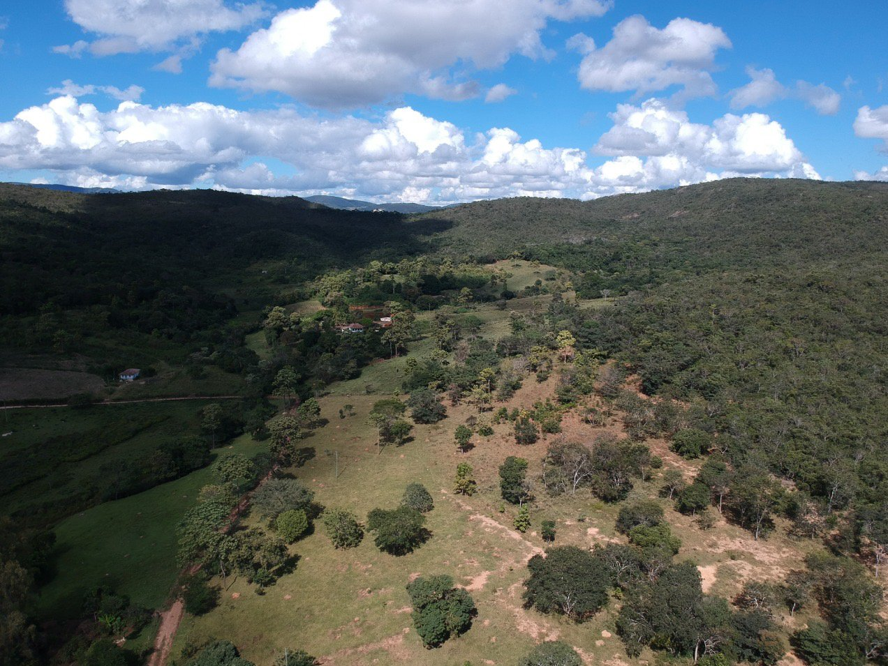

#### Ponto 6

Descrição: 

Solo Predominante:

Uso e ocupação atual:

Situação ambiental:

Imagens:

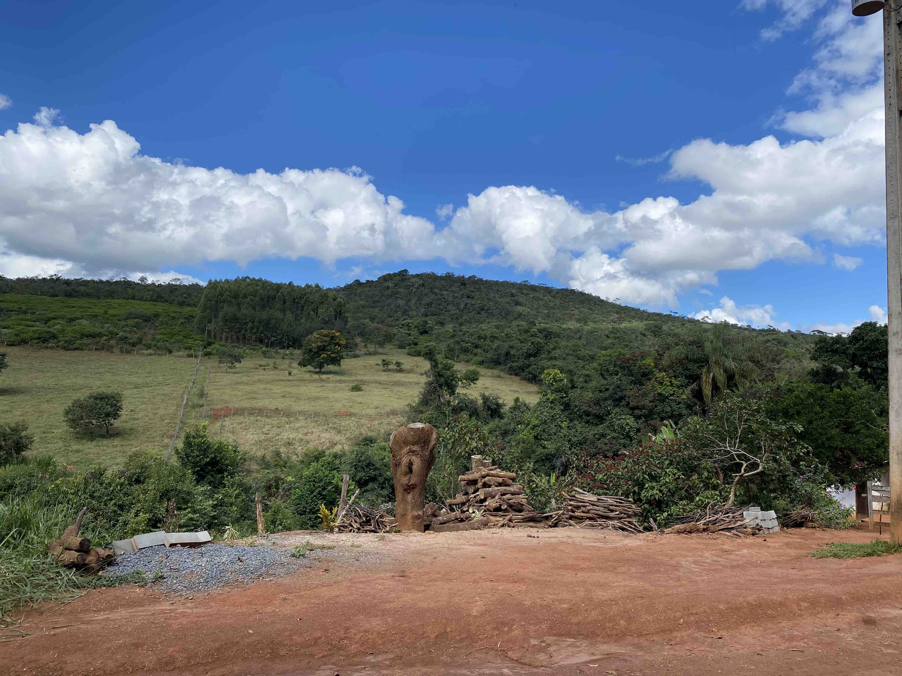

#### Ponto 7

Descrição: 

Solo Predominante:

Uso e ocupação atual:

Situação ambiental:

Imagens:

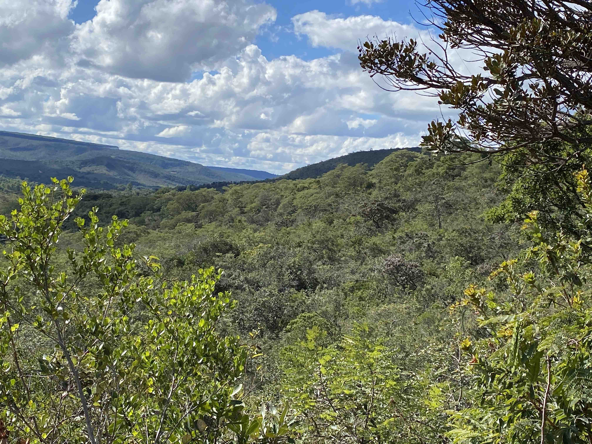

#### Ponto 8

Descrição: 

Solo Predominante:

Uso e ocupação atual:

Situação ambiental:

Imagens:

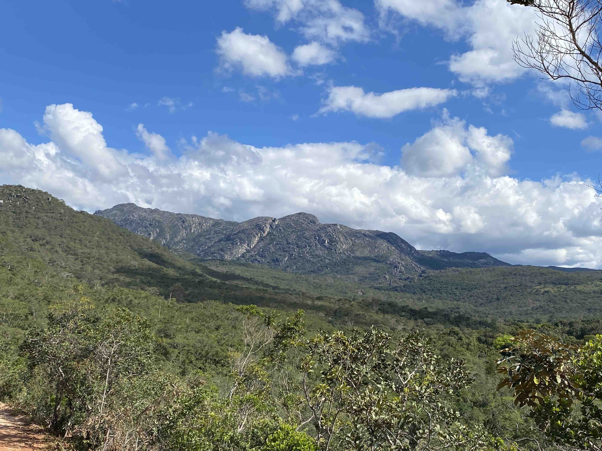

#### Ponto 9

Descrição: 

Solo Predominante:

Uso e ocupação atual:

Situação ambiental:

Imagens:

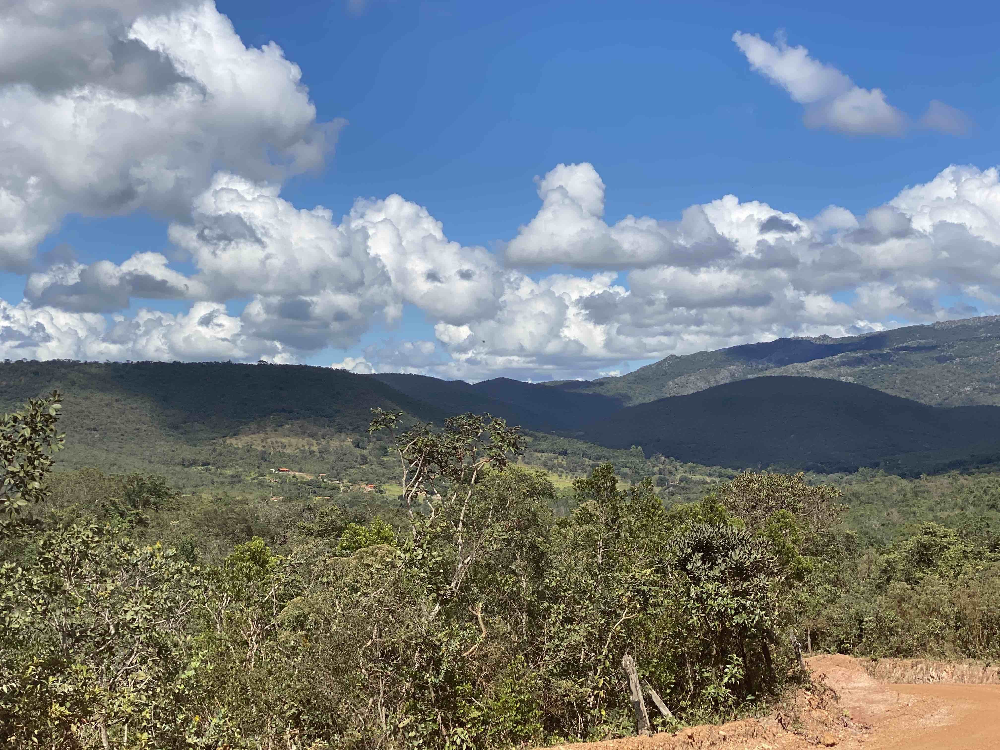

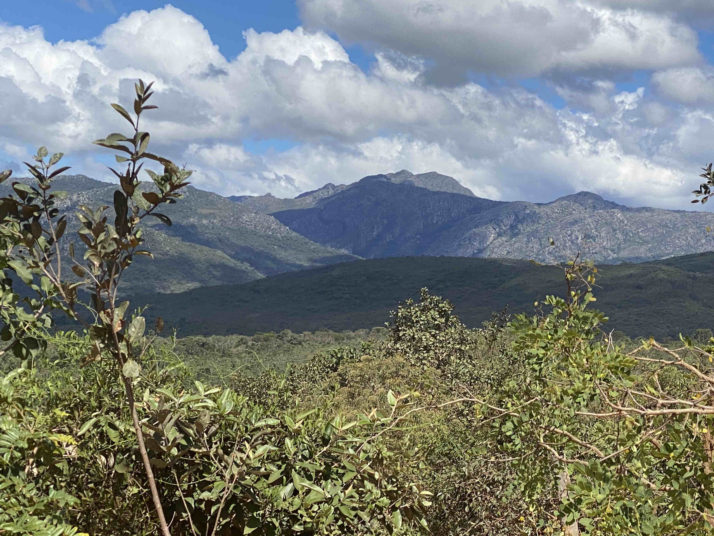

### Unidades de Paisagem

Nove unidades de paisagem foram identificadas na bacia do Ribeirão Santana: afloramento, anfiteatro, colina de topo alongado, complexo côncavo/convexo, superfícies tabulares, planícies e terraços fluviais, vale em v encaixado, vertentes ravinadas e vertentes retilíneas. A definição das unidades seguiu uma metodologia de caracterização integrada do meio físico, do meio biótico e antrópico, permitindo uma adequação ambiental e produtiva dos diferentes compartimentos geográficos.

#### Afloramento

Ocorrência: Porção sul da bacia; grande distribuição areal; vincula-se à quartzitos do Supergrupo Espinhaço; Região mais elevada (cotas entre 1740 a 900m). Limita-se com as Vertentes Ravinadas e contém Vales Encaixados;	De escarpas a rampas rochosas, com mergulho preferencial para Leste que condicionam uma hidrografia local dos tipos Subsequentes (determinados por zonas de fraquezas) e consequentes condicionados pelo mergulho da camada litológica.

Relevo: Expressiva área com declividade predominante acima de 45% podendo nas porções mais cimeiras e/ou mais dissecadas apresentar declividade superior a 75%.	

Tipo de solo: Neossolo litólico;	

Potencialidades:

1. Beleza cênica
2. Sítios de Geodiversidade 
3. Aquíferos fraturados	

Limitações:

1. Acessibilidade
2. Relevo acidentado
3. Parte da unidade está Inserida na Zona de Amortecimento do Parque Estadual do Rio Preto
4. Solos com baixa fertilidade	

Aptidões:

1. Pesquisas científicas em Campos Rupestres
2. Ecoturismo

#### Anfiteatro

Ocorrência: Porção centro-leste da bacia. Vincula-se ao domínio do Granito Itanguá. Limita-se com as unidades Complexo Côncavo-Convexo; Colina de Topo Alongado Terraços e Planícies Fluviais. Variação de cota entre 860 a 740m). Trata-se de uma vertente côncava aberta.	

Relevo: Típico circo de erosão apresentando declividade predominante de até 20% podendo nas partes mais declivosas atingir cercas de 45%. Tem a fisiografia de um vale semicircular cuja bacia de recepção é sensivelmente larga e pouco declivosa. Apresenta um residual de uma paleovertente. A concavidade dessa unidade permite a concentração de águas pluviais e sedimentos, mantendo os solos inseridos em satisfatórias condições de umidade.	

Tipo de solo: Argissolo e Cambissolos	

Potencialidades:

1. Boas condições hídricas por ser área de concentração de águas pluviais

Limitações:

1. Susceptibilidade à erosão
2. Solos com baixa fertilidade podendo ocorrer Cambissolos com fertilidade média

Aptidões:

1. Agropecuária
2. Áreas de preservação permanente (nascentes)
3. Culturas anuais e/ou sazonais, incluindo capineiras

#### Colinas de topo alongado	

Ocorrência: Porção leste da bacia (eixo SW-NE); Encontra-se no domínio do Granito Itanguá. Limita-se com as unidades: Complexo Côncavo-Convexo; Anfiteatro e Vertentes Retilíneas. Parte superior da encosta (cotas entre 900 a 840m).

Relevo: Elevação alongada e relativamente ilhada, sugerindo ser testemunho de uma paleosuperfície por não apresentar uma conectividade no seu modelado. Fisiografia consequente da dissecação que condicionou a unidade Planície/Terraços Fluviais. 

Tipo de solo: Predominância de Argissolo podendo ocorrer Latossolos

Potencialidades:

1. Relevo suave
2. Solos profundos
3. Áreas de Recarga

Limitações:

1. Uso limitado por ser topo de morro (Código Florestal)
2. Predisposição a processos erosivos principalmente nas áreas de Argissolos
3. Solos com baixa fertilidade

Aptidões:

1. Áreas de preservação permanente do tipo Topo de Morro
2. Manutenção de vegetação nativa (Floresta Estacional Semi-Decidual)
3. Apicultura, culturas permanentes, pastagens, silvicultura, fruticultura arbórea, cafeicultura

#### Complexo côncavo convexo	

Ocorrência: Porção centro-norte da bacia; Ocorrência sobre rocha granítica, denominada Granito Itanguá; limita-se com Superfícies Tabulares, Vertentes Ravinadas, Colinas de Topo Alongado; Terraços e Planícies Fluviais

Relevo: Conjunto de Vertentes Côncavas e Convexas. Expressiva área com declividade predominante acima de 45% podendo nas partes mais declivosas atingir 75%. Formam um sistema de captura e armazenamento de água pluvial.Expressiva área com declividade predominante acima de 45% podendo nas partes mais declivosas atingir 75%

Tipo de solo: Argissolos, Cambissolos e Neossolo Litólico

Potencialidades:

1. Recursos hídricos superficiais abundantes
2. O contato com outras unidades de paisagem potencializa: preservação ambiental pela presença de nascentes nos contatos com as Superfícies Tabulares e Colinas de Topo Alongado
3. Agriculturas sazonais e perenes quanto em contato com Terraços e Planícies Fluviais

Limitações:

1. Relevo acidentado
2. Solos rasos e suscetibilidade à erosão (Laminar e Sulco)
3. Solos com baixa fertilidade podendo ocorrer Cambissolos com fertilidade média

Aptidões:

1. Áreas de preservação quando próximas às Superfícies Tabulares, Vertentes Ravinadas e Colinas de Topo Alongado
2. Área de recarga de aquífero
3. Culturas permanentes quando relevo é suavizado, próximo a unidade Terraços e Planícies Fluviais
4. Apicultura, Culturas permanentes. Pastagens, silvicultura, fruticultura arbórea, cafeicultura

#### Superfícies tabulares	

Ocorrência: Porção NW da bacia; cotas altimétricas entre 960 e 940m. Limita-se com as unidades: Vertentes Ravinadas e Complexo Côncavo-Convexo. Áreas de recarga de aquífero que determinam o uso e ocupação do solo tradicional nas meias vertentes e fundo de vale, sistema chapada-grota. Remanescentes de Cerrado Sentido Restrito, mas com intensa ocupação por silvicultura (eucalipto).  

Relevo: Forma topográfica que se assemelha a planaltos, limitados por vertentes abruptas. regionalmente (Alto Jequitinhonha) é denominada como “chapadas”. 

Tipo de solo: Latossolo vermelho

Potencialidades:

1. Solo profundo, permeável, com aquíferos alçados devido à presença de horizontes lateríticos
2. Relevo plano que permite mecanização
3. Pesquisa científica 
4. Recarga da bacia

Limitações:

1. Solos com baixa fertilidade, elevada acidez
2. Escassez de recurso hídrico superficial

Aptidões:

1. Extrativismo vegetal e pecuária extensiva (usos tradicionais)
2. Apicultura, culturas permanentes, pastagens, silvicultura, fruticultura arbórea, cafeicultura

#### Planícies e terraços fluviais	

Ocorrência: Porção central e norte da bacia (eixo SW-NE, cotas entre 720 a 760m). Limita-se com as unidades: Complexo Côncavo-Convexo; Vertentes Ravinadas e Vertentes Retilíneas. Área mais antropizada da bacia contempla a sede urbana de Felício dos Santos.

Relevo: Relevo plano a suave ondulado. As Planícies contemplam as áreas mais baixas do relevo, distribuído ao longo dos cursos d´água e os terraços são as antigas planícies atualmente com cotas superiores

Tipo de solo: Solos sedimentares predominando Neossolo Flúvico, Gleissolos nas planícies e nos terraços Cambissolos (observados na margem esquerda) nas partes mais elevadas ocorrem Argissolos.

Potencialidades:

1. Recurso hídrico superficial disponível
2. Relevo plano (planície) e, ou pouco declivoso (terraços)

Limitações:

1. Planícies com suscetibilidades às ocorrências de inundações periódicas e encharcamento dos solos
2. Redução de áreas para uso e ocupação da vegetação ciliar
3. Presença de solos de média, podendo atingir, alta fertilidade

Aptidões:

1. Nas planícies culturas anuais de entressafra
2. Preservação de nascentes difusas
3. Terraços agropecuária e expansão urbana
4. Áreas aptas a preservação permanente, inclusive vegetação ciliar

#### Vales em V encaixado	

Ocorrência: A unidade de paisagem Vale em V ocorre na porção centro-sul da bacia, nas regiões mais elevadas, em cotas altimétricas entre 1740 a 900m. Ocupa cerca de 3.58% da área da bacia. É associada à hidrografia local dos drenagens  subsequentes (determinados por zonas de fraquezas) e consequentes (condicionados pelo mergulho das camadas quartzíticas). Limita-se com as unidades de Afloramento (quartzitos do Supergrupo Espinhaço) e Vertentes Ravinadas. Caracteriza-se por ocorrência de uma vegetação arbórea densa, pela presença de água.
Relevo: Vales com vertentes íngremes e rochosas, planícies e terraços fluviais imperceptíveis.

Tipo de solo: Neossolo Litólico

inserir figura vale em V

Potencialidades:
1.	Porção alta do curso principal do ribeirão Santana e tributários que estão em planos de fratura dos quartzitos (nascentes), proporcionando aquíferos fraturados.
2.Abundância de recursos hídricos superficiais, com ocorrência de quedas d’água e  águas superficiais cristalinas e oxigenadas

Limitações:
1.	Relevo fortemente acidentado
2.	Acessibilidade. Sem estradas vicinais nem trilhas para acesso
3.	Declividade acentuada (45 a 75%)
4.	Ausência de solos 
5.	Parte da unidade está Inserida na Zona de Amortecimento do Parque Estadual do Rio Preto

Aptidões:
1.	Áreas para preservação permanente (APP de Mata Ciliar e Nascentes) 
2.	Inserida na Zona de Amortecimento do Parque Estadual do Rio Preto
3.	Refúgio Silvestre

#### Vertentes ravinadas	

Ocorrência: As Vertentes ravinadas ocorrem porção central da bacia (eixo NW-SE) com alta representatividade areal, cerca de 27.87% da área total. Caracteriza-se pelo substrato com predominância dos quartzitos sericíticos do Grupo Macaúbas; Limita-se com as unidades: Superfícies Tabulares; Complexo Côncavo-Convexo; Afloramentos de Quartzitos, Terraços e Planícies Fluviais e Vale em V encaixado (Figura XXXX). 

Relevo: Assemelham-se as vertentes do Complexo Côncavo-Convexo, porém os processos da erosão pluvial são marcantes.

Tipo de solo: Cambissolo e Neossolo Litólico

nseir figura vertente ravinada

Potencialidades: 

1. Recursos hídricos superficiais decorrentes de surgência de aquíferos
2. O contato com as outras unidades de paisagem ocasionam distintas potencialidades para esta unidade
3. Preservação ambiental e uso recreativo em contato com unidades de Afloramento Rochoso e Vale Encaixado
4. Agriculturas sazonais e perenes no contato com Complexo Côncaco-Convexo e Terraços e Planícies Fluviais
5. Aptidão para pecuária no restante da unidade

Limitações:

1. Os solos das vertentes apresentam baixos graus de desenvolvimento e, consequentemente, elevadas instabilidades mecânicas e devem ser mantidos nas condições naturais
2. Expressiva área com declividade predominante acima de 45% podendo nas partes mais declivosas atingir 75%
3. Parte da unidade está Inserida na Zona de Amortecimento do Parque Estadual do Rio Preto
4. Solos com baixa fertilidade podendo ocorrer Cambissolos com fertilidade média

Aptidões:

1. Áreas de preservação (nascentes e áreas com declividade superior 45º)
2. Pastagem
3. Extrativismo vegetal (coleta) nas áreas com vegetação nativa
4. Pontualmente: uso recreativo (Lageado)
5. Apresentam possibilidades para instalações de pequenos barramentos para aproveitamento das águas pluviais, com ganhos de volumes de água em profundidade com um mínimo de lâmina d’água

#### Vertentes retilíneas	

Ocorrência: Porção leste bacia (eixo SW-NE); encontra-se no domínio do Granito Itanguá. Limita-se com as unidades: Colina de Topo Alongado e Terraços e Planícies Fluviais. Parte intermediária da meia encosta (cotas entre 840 a 800 m).

Relevo: Vertente com declividade menos acentuadas podendo estar vinculadas a rampas de colúvio.

Tipo de solo: Predominância Argissolo podendo ocorrer Latossolos.

Potencialidades:

1. Solos profundos
2. Mecanização agrícola

Limitações:

1. Argissolos são susceptíveis à compactação por uso de máquinas ou pisoteio de animais
2. Fisiografia com alta susceptibilidade de processos de erosão Pluvial (laminar e sulco)
3. Morfogênese vinculada a movimentos gravitacionais
4. Solos com baixa fertilidade

Aptidões:

1. Agropecuária
2. Culturas anuais
3. Pastagens, silvicultura, fruticultura e capineiras sob sistemas de controle de erosão
4. Parte da unidade está Inserida na Zona de Amortecimento do Parque Estadual do Rio Preto

| Unidade Paisagem             | Potencialidade                                                                                                                                | Limitações                                                                                                                                                              | Aptidões                                                                                                            | %                |
|------------------------------|-----------------------------------------------------------------------------------------------------------------------------------------------|-------------------------------------------------------------------------------------------------------------------------------------------------------------------------|---------------------------------------------------------------------------------------------------------------------|------------------|
| Superfícies Tabulares        | Relevo plano e solos bem desenvolvidos e permeáveis.                                                                                          | Solos de baixa fertilidade e acidez elevada.                                                                                                                            | Agricultura mecanizada, silvicultura, fruticultura e pastagens cultivadas.                                          | 3.5667083785395  |
| Vertente Ravinada            | Pode ocorrer surgências de aquíferos (nascentes)                                                                                              | Solos rasos e pedregosos em relevos fortemente acidentados.                                                                                                             | Áreas para preservação permanente e proteção de nascentes.                                                          | 27.866222142771  |
| Vale em V                    | Áreas de surgências de aquíferos (nascentes) e cursos d'água de primeira ordem.                                                               | Solos rasos e pedregosos em relevos fortemente acidentados.                                                                                                             | Áreas para preservação permanente e proteção de nascentes.                                                          | 3.57685488085205 |
| Afloramento                  | Beleza cênica e fornecimento de material para construção civil.                                                                               | Afloramento e relevo escarpado.                                                                                                                                         | Retirada de brita.                                                                                                  | 25.3773633867514 |
| Complexo Côncavo Convexo     | Solos profundos e permeáveis. Concentração de águas de chuva e nutrientes.                                                                    | Baixa fertilidade e acidez elevada, comprimento da vertente em declive e suscetibilidade a processos de erosão hídrica laminar. Solos rasos e suscetíveis à erosão.     | Culturas permanentes e preservação permanente.                                                                      | 20.5197837573034 |
| Colina Alongada              | Relevo suave nos topos, com solos profundos e permeáveis. Constituem áreas de recarga de aquíferos freáticos.                                 | Uso limitado pela legislação ambiental nos topos das colinas. Relevo acidentado das vertentes e predisposição a processos de erosão laminar.                            | Manutenção da vegetação nativa nos topos. Culturas permanentes incluindo cafeicultura, fruticultura e silvicultura. | 2.24001544355318 |
| Planicie e Terraços Fluviais | Relevo plano podendo ocorrer solos de média a alta fertilidade.                                                                               | Suscetibilidades às ocorrências de inundações periódicas e encharcamento geomorfológicas das bacias dos solos.Redução de áreas para uso e ocupação da vegetação ciliar. | Culturas anuais de entressafra, preservação de nascentes difusas. Agroperucária e expansão urbana.                  | 12.3766046645352 |
| Anfiteatro                   | Médios a altos níveis de fertilidade e boas condições hídricas dos solos. Área de concentração de águas pluviais: ocorrência de olhos d'água. | Susceptibilidade à erosão.                                                                                                                                              | Culturas anuais e permanentes, apicultura, área de preservação permanente e proteção de nascentes.                  | 0.64759124231907 |
| Vertente Retilínea           | Solos profundos e permeáveis. Concentração de águas de chuva e nutrientes.                                                                    | Susceptíveis à compactação e a processos de erosão pluvial (laminar e sulco). Solos com baixa fertilidade.                                                              | Agricultura mecanizada, silvicultura, fruticultura e pastagens cultivadas.                                          | 3.82885610337515 |

As Unidades de Paisagem com maior representatividade na bacia são as vertentes ravinadas cobrindo cerca de 27,9% da bacia, os afloramentos rochosos cobrindo cerca de 25,4% e o completo concavo/convexo representando cerca de 20,5%. Destas, apenas o complexo côncavo/convexo possui aptidão agrícola para culturas pemanentes. As vertentes ravinadas e afloresamentos devem ser prioritariamente destinadas à àrea de preservação e proteção de nascentes. As unidades da paisagem presentes na bacia com potencial de uso agrícola e pastagem são o complexo côncavo/convexo, a planície e terraços fluviais, a vertente retilínia e a superfície tabular. A unidades do tipo anfiteatro e colinas alongadas podem ser destinadas a agrilcutura e pecuária desde que sigam um manejo adequado.

### Disponibilidade hídrica

O diagnóstico realizado identificou 3 processos de cadastro de uso insignificante e 1 processo de outorga de uso individual, totalizando 4 usuários de água com processos vigentes na bacia e com os critérios de inclusão neste estudo. Este número é sem dúvida muito inferior ao número de usuários real de água. As outorgas estão distribuídas no curso principal do Ribeirão Santana, no médio e baixo. O uso da água na bacia têm como finalidade principal o abastecimento humano e a irrigação de pequenos cultivos agrícolas.Não há demanda hídrica na bacia para uso intensivo da água para irrigação de grandes áreas e pivôs, predominando a criação extensiva de animais, com pequenas lavouras espalhadas principalmente na porção média e baixa da bacia. A vazão limite para cadastro de uso insignificante na região é de 0,5L/s (0,0005m³/s).

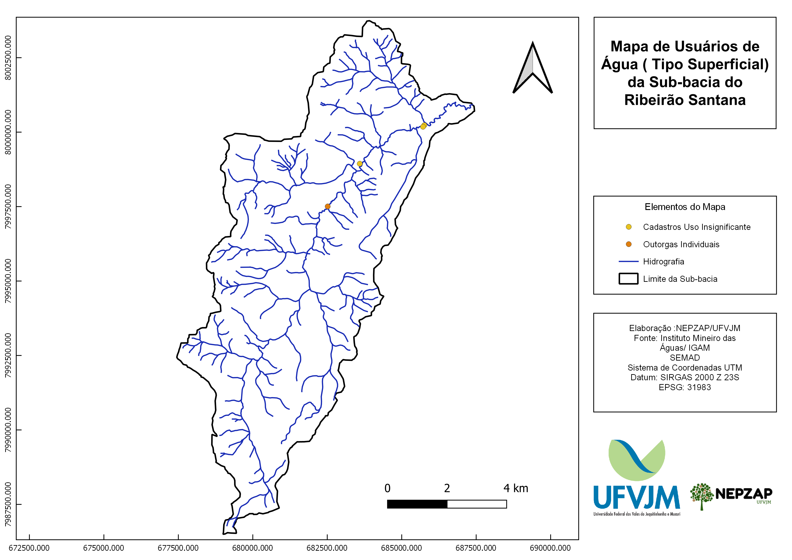

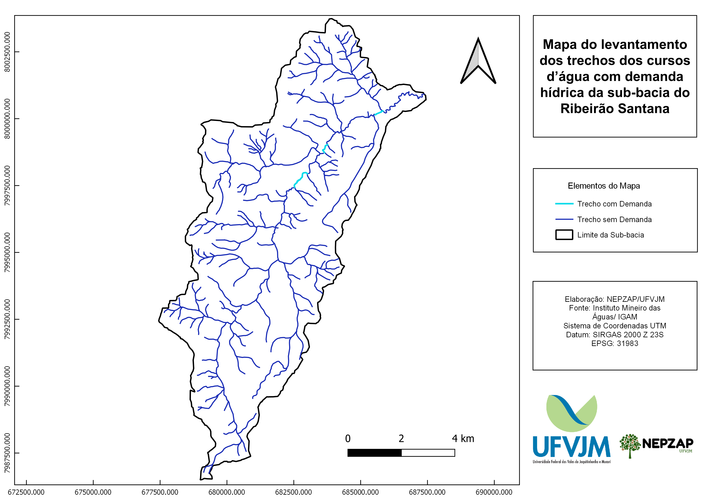

Dois usuários com cadastro de uso insignificante estão localizados no trecho 75829983 do Ribeirão Santana, e um único usuário com cadastro de uso insignificante está localizado no trecho 7582998591. Esses usuários não comprometem a disponibilidade hídrica nos seus respectivos trechos do curso d'água. No trecho 7582998733 a vazão outorgada encontra-se acima do limite de 50% da Q710, comprometendo disponibilidade hídrica do Ribeirão Santana. 

| Código do trecho | Nome do curso d'água | Qmld (m³/s) | Q710 (m³/s) | Qreg (m³/s) | Q outorgável (m³/s) | Q demandada (m³/s) | QDH (m³/s) | Comprometimento DH (%) | Viabilidade de regularização de Q |
|------------------|----------------------|-------------|-------------|-------------|---------------------|--------------------|------------|------------------------|-----------------------------------|
| 75829983         | Ribeirão Santana     | 0.51821     | 0.01199     | 0.35675     | 0.005997            | 0.001              | 0.00500    | 16.67                  |                                   |
| 7582998591       | Ribeirão Santana     | 0.43676     | 0.00976     | 0.30085     | 0.004881            | 0.0005             | 0.00438    | 10.24                  |                                   |
| 7582998733       | Ribeirão Santana     | 0.32747     | 0.00690     | 0.22578     | 0.003451            | 0.00823            | -0.00478   | 238.50                 | sim                               |

Obs: Qmld = Vazão média de longo período; Q7,10 = Vazão de referência;  Q outorgável = 50%Q7,10; Qreg = vazão potencial de regularização; QDH = vazão de disponibilidade hídrica; Viabilidade de regularização de Q: se Qreg + QDH > 0, há viabilidade

É importante ressaltar que alguns processos vencidos não tomaram iniciativa de realizar a renovação e existem captações observadas em campo que não se encontram na base do SIAM. Desta maneira, os dados oficiais validados mostram um cenário incompatível com a realidade da bacia em estudo. Recomenda-se que o poder público e os órgãos extensionistas realizem campanhas sobre a importância da solicitação de outorga para o real compreensão da demanda de água na bacia.

### Uso e ocupação do solo

A partir da imagem Sentinel-2 foram identificadas 9 (nove) classes relevantes de uso e ocupação na bacia do Ribeirão Santana, sendo elas em ordem de representatividade: Vegetação Nativa, Pastagem, Afloramanto Rochoso, Área Urbana, Floresta Plantada, Agricultura, Solo Exposto, Benfeitorias, Represas. As classes identificadas no estudo estão de acordo com a metodologia ZAP oficial. 

| Uso do Solo       | representatividade (%) |
|-------------------|------------------------|
| Afloramento       | 11.81                  |
| Agricultura       | 0.76                   |
| Benfeitoria       | 0.06                   |
| Floresta plantada | 1.66                   |
| Pastagem          | 18.52                  |
| Represa           | 0.05                   |
| Solo exposto      | 0.21                   |
| Urbana            | 1.81                   |
| Vegetação nativa  | 65.10                  |

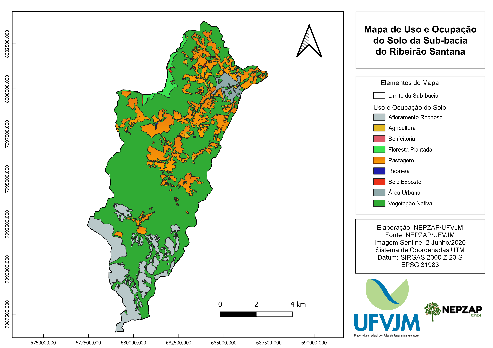

A classe de maior representatividade na bacia do Ribeirão Santana está relacionada a Vegetação Nativa, com 65,1%, seguida por Pastagem com 18,5% e afloramento rochoso com 11,8%. As classes área urbana, floresta plantada, agricultura, solo exposto, benfeitorias e represa apresentam uma porcentagem a baixo de 2% individualmente. As áreas de pastagem apresentam variados níveis de degradação, e nos pontos de solo mais arenoso, e recomenda-se um manejo mais cuidadoso em relação à perda de solo e erosão laminar. Em geral, a bacia apresenta um bom nível de conservação, com presença expressiva de vegetação nativa por toda a sua extensão.

Representando 1,6% da área da bacia o cultivo de floresta plantada se faz presente na porção norte da bacia, nas formações tabulares. Os cultivos agrícolas abrangem 0,75% da área total, de forma fragmentada nas propriedades. Solo exposto ocupa 0,2% da área total, ocorre principalmente em pastagens e em associação com estradas. Represas (corpos d’água) embora numerosas, abrangem apenas 0,05% de forma fragmentadas e espalahdas na paisagem.

### Área de preservação permanente

As áreas de preservação permanente, regulamentadas por lei (MINAS GERAIS, 2013), são áreas que devem ser preservadas para que não haja significantes alterações ambientais capazes de desestabilizar ecossistemas. Foram identificadas as APPs hídricas diferenciadas por: i) nascentes e ii) cursos d’água. Não houveram represas com área superior a 1 ha, sendo portanto dispensadas de possuirem área de preservação permanente. Nas nascentes foi aplicado um buffer de 50 e ao longo dos cursos d'água um buffer de 30 metros. A área total de APPs hídrica da bacia do Ribeirão Santana é cerca de 854,52 hectares, representando aproximadamente 12% de toda a área de estudo. Foram identificadas 166 nascentes após correção da hidrografia, incluindo nascentes de cursos d’água intermitentes, totalizando 119,4 hectares.

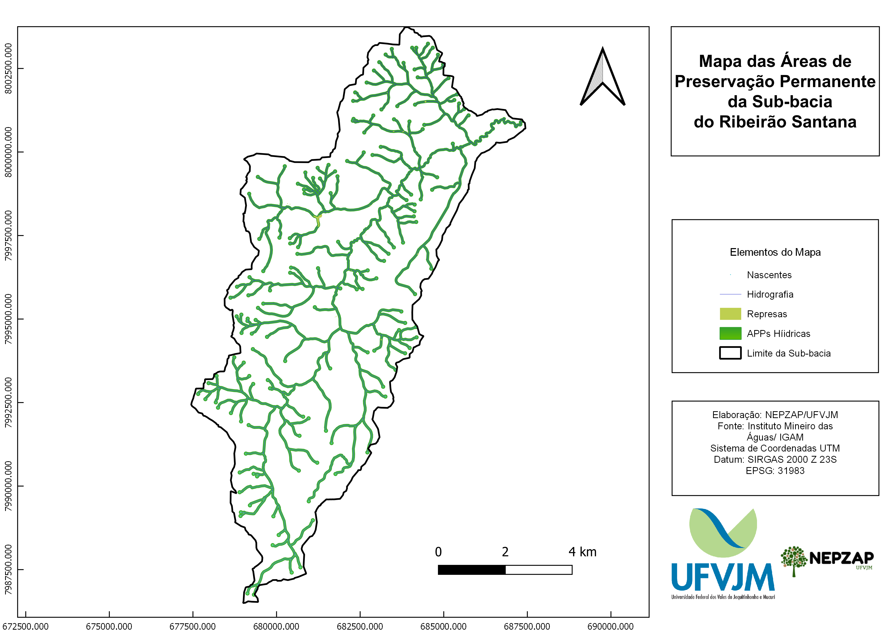

## Considerações gerais

Nesta seção serão apresentandos os conflitos referentes ao uso do solo com as áreas de preservação permanente e aptidão das unidades de paisagem. São apresentados também os índices que representam a atual condição da bacia: índice de conservação da bacia, de antropisação das APPs hídricas, de concentração de nascentes e de uso conflitante na bacia.

### Áreas conservadas e antropisadas

As classes de uso do solo vegetação nativa e afloramento rochoso foram consideradas conservadas, enquanto as classes floresta plantada, benfeitorias, agricultura, urbana, solo exposto e pastagem foram consideradas antropisadas. A classe de represa foi desconsiderada por representar corpos hídricos. O índice de conservação da bacia foi de 76,96%. Este índice indica o grau de ocupação da bacia com atividades antrópicas. No entanto, ele não deve ser avaliado de forma isolada. 

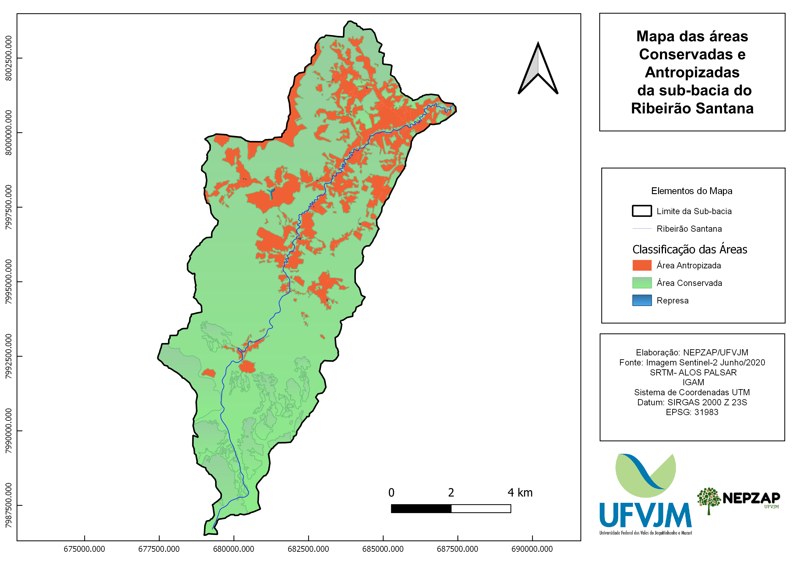

A bacia apresenta um grau de antropização diferente conforme região analizada. A concentração das atividades antrópicas na parte média e baixa da bacia coincide com as unidades de paisagem de maior aptidão para agricultura e pastagem. A parte alta da bacia, onde predomima a unidade de paisagem de afloramentos rochosos, é a porção mais preservada.

| Tipo de área | Área (ha) | Representatividade (%) |
|--------------|-----------|------------------------|
| Conservada   | 5605,85   | 76,96                  |
| Antropizadas | 1677,42   | 23,03                  |
| Área total   | 7284,118  |                        |

### Conflito com areas de preservação permanente

A informação de APPs hídricas conservadas e antropizadas pode ser utilizada para indicar áreas prioritárias para recuperação. Espacialmente, as APPs hídricas conservadas são representadas pela interseção entre as classes de uso e ocupação do solo vegetação nativa e afloramento rochoso. Já as APPs antropizadas são interseccionadas com as classes de uso e ocupação do solo benfeitorias, pastagem, agricultura, silvicultura, área urbana e solo exposto. o índice de antropização das APPs hídricas foi de 20%.

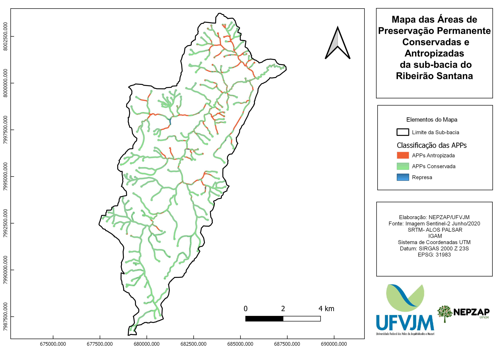

| Tipos de área | Área (ha) | Representatividade (%) |
|---------------|-----------|------------------------|
| Conservada    | 776,880   | 80                   |
| Antropizadas  | 192,350   | 20                   |
| Represas      | 2,262     |                    |
| Área total    | 971,490   |                        |

### Conservação de nascentes

O cálculo de concentração de nascentes possibilita a visualização numérica da quantidade de nascentes por área total da bacia. Ele facilita à priorização de alocação de recursos para a adequação ambiental da bacia quando se trata de recuperação de nascentes e disponibilidade hídrica. Presume-se que cada APP de nascente equivale a um raio de 50 metros, que, convertendo para hectares, resulta no valor de 0,78 por nascente. Este é por sua vez multiplicado pelo número de nascentes encontradas e dividido pela área total da bacia. O resultado pode ser interpretado em uma escala de 0 a 100, sendo que quanto maior o valor, maior a concentração de nascentes na bacia. O índice de concentração de nascentes foi de 1.77%.

| Variáveis           | Valores    |
|---------------------|------------|
| Número de nascentes | 166        |
| fator               | 0,78       |
| N * fator           | 129,48     |
| Área da bacia       | 7284,12    |
| I_cb                | 1,77       |

### Conflito de uso e ocupação do solo

O conflito entre unidades de paisagem e uso e ocupação do solo expõe as áreas da bacia que sofrem maior impacto ambiental por determinado tipo de uso em certa unidade de paisagem. É um importante subproduto a ser analisado para determinar áreas que devem sofrer intervenção em seu uso visando uma melhor conservação da bacia. Áreas de conflito são obtidas por meio da interseção entre estes dois produtos utilizando técnicas de geoprocessamento. É identificada a quantidade de área que cada classe de uso do solo representa nas unidades de paisagem e decidido, a partir das aptidões das unidades de paisagem e visitas de campo, onde há compatibilidade e incompatibilidade de usos. As áreas associadas à classe de conflito “controle e manejo” podem ser utilizadas para agricultura ou pecuária desde que sejam utilizadas técnicas de controle e manejo do solo adequadas. A classificação “não aplicável” foi dada às classes de uso não passíveis de alteração por inviabilidade ou consolidação de uso, como exemplo área urbanas e minerárias.

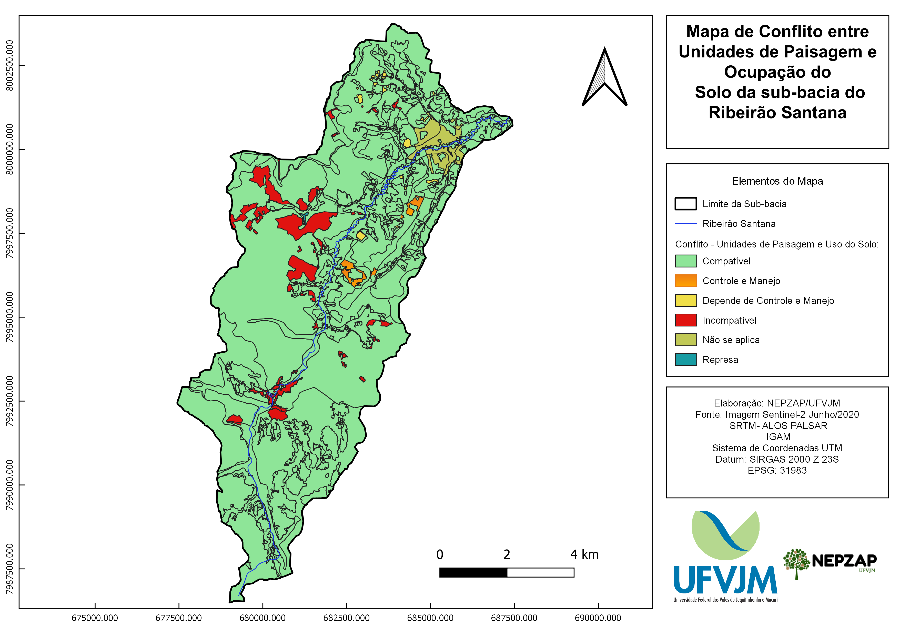

| Uso e unidade de paisagem | Área (ha) | Representatividade (%) |
|---------------------------|-----------|------------------------|
| Compatível                | 6760,27   | 92,81                  |
| Incompatível              | 320,687   | 4,40                   |
| Controle e manejo         | 66,261    | 0,91                   |
| Outros                    | 136,9     |                        |
| Área total                | 7284,118  |                        |

Os valores de área em hectares da análise de conflito são utilizados para o cálculo do índice de uso conflitante da bacia. A bacia apresentou em sua totalidade um índice de 4,4% de incompatibilidade entre unidade de paisagem e uso do solo. Quanto maior o valor, maior o conflito entre o uso e ocupação do solo atual com as unidades de paisagem identificadas na bacia. A unidade de paisagem com maior incompatibilidade de uso foram as vertentes ravinadas, seguido pelo vale em V e superfícies tabulares.

| Unidade de paisagem          | Incompatível (ha) | Representatividade (%) |
|------------------------------|-------------------|------------------------|
| Vertente Ravinada            | 268,34            | 13,22                  |
| Anfiteatro                   |                   |                        |
| Superfícies Tabulares        | 9,38              | 3,61                   |
| Complexo Côncavo Convexo     | 5,19              | 0,35                   |
| Vertente Retilínea           |                   |                        |
| Colina Alongada              |                   |                        |
| Vale em V                    | 10,42             | 4,00                   |
| Afloramento                  | 26,57             | 1,44                   |
| Planicie e Terraços Fluviais | 0,79              | 0,09                   |

### Resumo dos índices

Todos os índices calculados para a bacia do Ribeirão Santana estão reunidos na tabela abaixo. A partir desses índices é possível realizar uma rápida comparação entre outros ZAPs realizados no estado e inferir sobre a realidade da bacia de modo relativo.

| Índice                                   | Valor   |
|------------------------------------------|---------|
| Índice de conservação da bacia           | 76,96 % |
| Índice de Antropização das APPs hídricas | 19,80 % |
| Índice de Concentração de Nascentes      | 1,77    |
| Índice de Uso Conflitante na bacia       | 4,40 %  |
