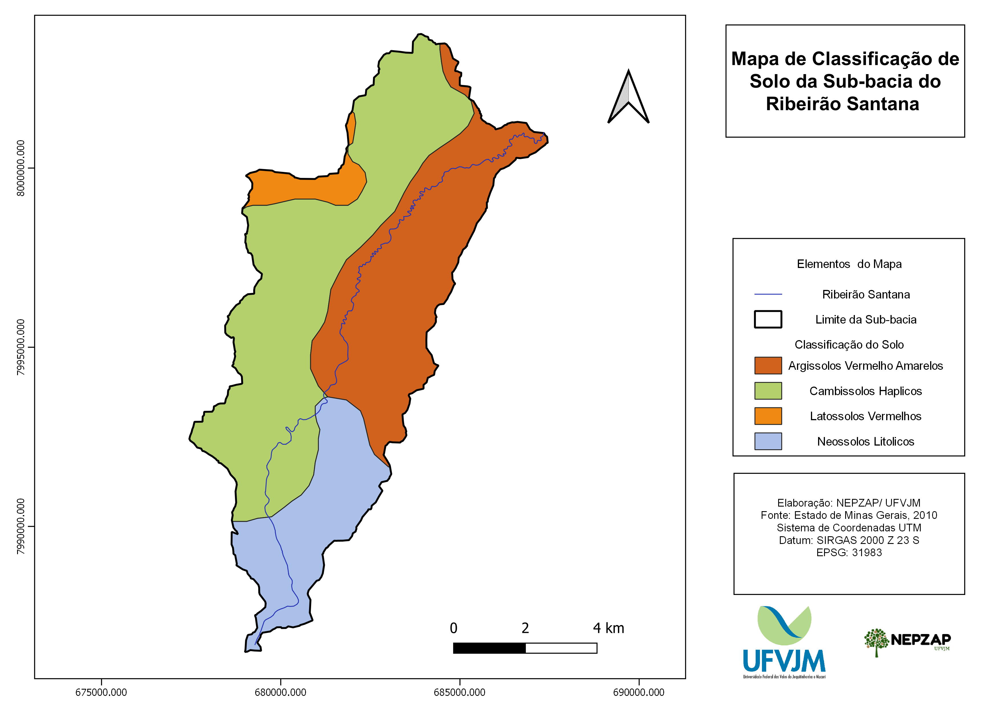

# ZAP - Bacia Hidrográfica do Ribeirão Santana

  <b>Autores:</b> 
    
  <a>Cristiano Matozinhos Christofaro</a> 
  <a>Gleyce Campos Dutra</a> 
  <a>Reynaldo Campos Santana</a> 
  <a>Danielle Piuzana Mucida</a> 
  <a>Marcelino Morais</a> 
  <a>Tamara Kelly Marques Rocha Nunes</a> 
  <a>Eric Bastos Gorgens</a>
    

## Introdução

A crescente demanda por recursos hídricos faz com que a gestão destes seja cada vez mais aprimorada nas regiões onde a água se encontra em estado de conflito de uso ou escassa. Novas metodologias de caracterização e interpretação de dados são elaboradas para auxiliar na resolução destes conflitos. 

O Zoneamento Ambiental Produtivo é uma dessas metodologias, aprovada pelo Estado de Minas Gerais em 2014, como metodologia oficial, que tem como objetivo aprimorar a gestão socioambiental e econômica de sub-bacias hidrográficas no Estado de Minas Gerais através da concepção de três produtos básicos que podem ser cruzados para obtenção de informações mais detalhadas. 

A sub-bacia do Ribeirão Santana, contemplada neste ZAP, está localizada na região do Alto Jequitinhonha de Minas Gerais, no município de Felício dos Santos e pertence à Unidade de Planejamento e Gestão de Recursos Hídricos do Rio Araçuaí (UPGRH JQ2). A demanda por água na região da sub bacia do Ribeirão Santana é amplo, sendo fundamantal a realização de um estudo a fim de se evitar e/ou resolver conflitos atuais e futuros, ressaltando então a importância de uma ferramenta como o ZAP para subsidiar um planejamento territorial que visa a conservação  e produtividade do espaço. Tornando essa metodologia ZAP primordial para estabelecer um diagnóstico apresentando sua caracterização, limitação e potencialidades de uso consiente para com o meio ambiente, permitindo que futuros projetos possam utiliza da mesma para auxílio na tomada de decisões na gestão territorial. A ausência de estudos socioambientais, na área onde se encontra a sub-bacia do Ribeirão Santana, faz com que a aplicação da metodologia ZAP, se torne ainda mais relevante. 

Três produtos principais compõem este estudo:definição das unidades de paisagem, diagnóstico da disponibilidade hídrica da sub-bacia e levantamento do uso e ocupação do solo. Através do cruzamento dos dados destes três produtos foi possível elaborar diagnósticos e análises ambientais acerca da referida sub-bacia. Um documento anexo intitulado como Potencial de Adequação sugere ainda intervenções, baseadas neste ZAP, que auxiliam a tomada de decisões na gestão de recursos hídricos da sub-bacia.

## Desenvolvimento

### Caracterização da bacia

A sub-bacia hidrográfica do ribeirão Santana está localizada, em sua totalidade no município de Felício dos Santos, a 369 km da capital do estado, Belo Horizonte. Com uma área de aproximadamente 45.00 hectares, se insere na Unidade de Planejamento e Gestão de Recursos Hídricos do rio Araçuaí (UPGRH JQ2). O seu curso principal, Ribeirão Santana, deságua no Rio Araçuaí, que por sua vez deságua no Rio Jequitinhonha.

De acordo com a classificação de Köppen-Geiger o regime climático na região da sub-bacia é tropical de altitude (Cwb), caracterizado por verões brandos e úmidos e invernos mais frescos e secos. Os índices de precipitação variam de 1250 mm a 1550 mm, e a temperatura média anual não ultrapassa os 20ºC, tendo uma variável entre 18ºC a 19ºC. Sub-bacia está localizada em um contexto geológico regional representado por rochas metamórficas do Supergrupo Espinhaço, em que se destacam especialmente os quartzitos, xistos e rochas metabásicas e do embasamento cristalino. As condições de clima e solos, por sua vez, favorecem o desenvolvimento de uma flora típica, com a presença de várias Fitofisionomias.

[Atualizar informações] Segundo estudos de Hasui et al. (2012), geologicamente a área está localizada no Cinturão Brasília, mais especificamente na Faixa Brasília, na porção oeste das unidades dos Grupos Canastra e Vazante, onde se concentram rochas metassedimentares. Ainda de acordo com Hasui et al. (2012), no grupo Canastra a sub-bacia do ribeirão Santa Isabel é constituída pelas Formações Paracatu e Chapada dos Pilões, compostas basicamente por quartzitos basais e filitos carbonosos. No grupo Vazante, a sub-bacia é composta pelas Formações Lapa e Serra do Poço Verde, representadas por dolomitos estromatolíticos, brechas intraformacionais, ardósias carbonosas, metassiltitos, arenitos conglomeráticos e quartzitos. A grande área de sedimentos clásticos e lateríticos ferruginosos não possui unidade específica, sendo caracterizada pela CODEMIG (2014) como cobertura superficial indiferenciada. 

Os solos identificados na sub-bacia, são representados pelas classes dos Argissolos Vermelhos Amarelos,Cambissolos Háplicos, Latossolos Vermelho e Neossolos Litólicos. Destes, o Cambissolos Háplicos, de maior ocorrência na área da sub-bacia, .........enquanto nos Latossolos Vermelhos de observa-se uma forte presença de atividades silviculturais.

A sub-bacia do ribeirão Santana faz parte da Serra do Espinhaço e apresenta um relevo suave ondulado na redição baixa da bacia e ondulado a montanhoso na região alta da bacia. A elevação varia de 1826 metros na cabeceira da sub-bacia, até 709 metros no encontro com o Rio Araçuaí. A declividade predominante está entre valores 0 e 8%, enquanto na região norte e leste há uma maior variação chegando a 45% de declividade.

### Bases de dados

Os materiais utilizados para este estudo constituem de pesquisas bibliográficas, visitas de campo, utilização de softwares de geoprocessamento e processamento de imagens de satélite, dados oficiais de órgãos ambientais, materiais de fotografia e localização. São eles, individualmente citados:

- Software QGIS vesão 3.10 e plugins;
- Software Google Earth Pro 7.3.2.5491, 64-bits;
- Software Google Earth Engine;
- Imagens Sentinel-2 e SRTM Globl DEM;
- Shapefile de drenagem da bacia do Rio São Francisco com escala de 1:100.000, obtido através da IDE-Sisema (Infraestrutura de Dados Espaciais do Sistema Estadual de Meio Ambiente e Recursos Hídricos);
- Shapefile de ottobacias da bacia do Rio São Francisco, obtido através da IDE-Sisema;
- Shapefile dos municípios do Estado de Minas Gerais, obtido através da IDE-Sisema;
- Shapefile de Declaração de Áreas de Conflito (DAC) obtido através da IDE-Sisema;
- Mapa geológico do Estado de Minas Gerais na escala de 1:100.000 da CODEMIG versão 2014;
- Mapa de classes de solos do Estado de Minas Gerais na escala de 1:500.000 da UFV versão 2010;

### Unidades de paisagem

Os mapas de solo, litologia, modelo digital de elevação e declividade auxiliam na elaboração de um dos principais produtos do ZAP, o mapa de Unidades de Paisagem. Nesta metodologia, considera-se a paisagem, dentro de cada especificidade local, como uma síntese dos componentes dos meios físicos (geologia, relevo e solos), meio biótico (vegetação nativa) e meio socioeconômico (atividades antrópicas). No caso específico a atividades rurais, é notória a familiaridade de produtores e trabalhadores rurais com a paisagem local, fato que facilita diálogos e discussões pertinentes à capacidade de suporte das respectivas Unidades de Paisagem.

As Unidades de Paisagem foram identificadas em mapa preliminar obtido através do uso de imagens do satélite Sentinel-2 de até 6 meses anteriores à data deste estudo, e da imagem SRTM de 30 metros. Foram utilizadas, para refinamento e auxílio, as imagens do Google Earth, com precisão de 0,5 a 1 metro, além da visualização 3D através do modo “exagero vertical”, que se baseia na topografia do terreno o modelando em 3D na tela do computador. É possível então, através de inferências, a caracterização específica a cada Unidade de Paisagem, enfatizando: morfologia, embasamento geológico/pedológico, cobertura vegetal nativa original, potencialidades, limitações, uso atual, aptidões e situação ambiental. Realizou-se correlações em campo, das Unidades de Paisagens e na sequência a identificação, para cada Unidade de Paisagem, das potencialidades, limitações, fragilidades e aptidões para fins múltiplos.

### Disponibilidade hidrica

Os dados utilizados para diagnóstico da Disponibilidade Hídrica foram disponibilizados pelo Instituto Mineiro de Gestão das Águas (IGAM) e pela Secretaria de Estado de Meio Ambiente e Desenvolvimento Sustentável de Minas Gerais (SEMAD). Em um primeiro passo foi necessário identificar o curso d’água principal da sub-bacia, no caso, Ribeirão Santa Isabel para extração da delimitação de acordo com a base ottocodificada do IGAM. A hidrografia com os dados de regionalização de vazão para os cálculos necessários ao diagnóstico foi obtida através da SEMAD juntamente com as informações de outorgas e cadastro de uso insignificante, conforme solicitado, através do anexo III da metodologia ZAP.

Após a delimitação da sub-bacia e de sua hidrografia, os dados de outorga e cadastro de uso insignificante foram consistidos e plotados seguindo a metodologia ZAP oficial proposta. Apenas usuários de água superficial são contemplados neste estudo de disponibilidade hídrica, no entanto, como forma demonstrativa, os dados subterrâneos também estão incluídos (sem parte nos cálculos realizados) com intuito de auxiliar na análise da gestão de recursos hídricos da sub-bacia. Todos os usuários que apresentam status de “Cadastro Efetivado”, “Outorga Deferida, Renovada e Retificada” foram contemplados no diagnóstico. Foram filtrados os dados, através da coluna de vencimento de outorga, todos os usuários que possuem processos com vencimento superior a março de 2018, sendo estes incluídos conforme informado na metodologia ZAP oficial. Para uma análise mais detalhada, também foram contemplados, em um segundo momento, usuários que apresentam status de “Aguardando Informação Complementar”, “Análise Técnica Concluída”, “Em Análise Técnica” e “Processo Formalizado”, a fim de apresentar um cenário futuro para a Disponibilidade Hídrica da sub-bacia.

Após a consolidação, os dados foram plotados em ambiente SIG, com os devidos cálculos para todos subprodutos da Disponibilidade Hídrica e então elaborado mapas que facilitam a interpretação. Os cálculos para cada subproduto da Disponibilidade Hídrica foram feitos de acordo com a metodologia oficial ZAP incluindo: disponibilidade hídrica de cada trecho, comprometimento hídrico de cada trecho. Ao término do processamento dos cálculos, para produção do mapa de Situação da Disponibilidade Hídrica foi necessário classificá-lo de acordo com o comprometimento de cada segmento: Indisponibilidade, Estado de atenção e Disponibilidade.

### Uso e ocupação do solo

O mapeamento do uso e ocupação do solo foi elaborado através de processamento de imagens de satélite, observações em campo (vide anexo II) e vetorização manual. Foram utilizadas duas imagens: I) Sentinel-2 de resolução espacial de 10 metros e bandas 2, 3, 4 e 8 intercalando entre cor-real e falsa-cor para identificação de diferentes feições; II) Como referência, quando necessária, imagens de satélite do Google Maps ou Bing Maps de resolução espacial de até 0,5 metros.

## Diagnóstico e análise ambiental da sub-bacia

### Unidades de Paisagem

As Unidades de Paisagem da sub-bacia do Ribeirão Santana foram caracterizadas por 9 (nove) classes: afloramento, anfiteatro, colina de topo alongado, complexo côncavo convexo, superfícies tabulares, planícies e terraços fluviais, vale em v encaixado, vertentes ravinadas e vertentes retilíneas, das quais fundamentam a metodologia de caracterização integrada do meio físico e inferências aos meios biótico e antrópico, culminando com a adequação ambiental e produtiva deste compartimento geográfico.

#### Afloramento

Ocorrência: Porção sul da bacia; grande distribuição areal; vincula-se à quartzitos do Supergrupo Espinhaço; Região mais elevada (cotas entre 1740 a 900m). Limita-se com as Vertentes Ravinadas e contém Vales Encaixados;	De escarpas a rampas rochosas, com mergulho preferencial para Leste que condicionam uma hidrografia local dos tipos Subsequentes (determinados por zonas de fraquezas) e consequentes condicionados pelo mergulho da camada litológica.

Relevo: Expressiva área com declividade predominante acima de 45% podendo nas porções mais cimeiras e/ou mais dissecadas apresentar declividade superior a 75%.	

Tipo de solo: Neossolo litólico;	

Potencialidades:

1. Beleza cênica
2. Sítios de Geodiversidade 
3. Aquíferos fraturados	

Limitações:

1. Acessibilidade
2. Relevo acidentado
3. Parte da unidade está Inserida na Zona de Amortecimento do Parque Estadual do Rio Preto
4. Solos com baixa fertilidade	

Aptidões:

1. Pesquisas científicas em Campos Rupestres
2. Ecoturismo

#### Anfiteatro

Ocorrência: Porção centro-leste da bacia. Vincula-se ao domínio do Granito Itanguá. Limita-se com as unidades Complexo Côncavo-Convexo; Colina de Topo Alongado Terraços e Planícies Fluviais. Variação de cota entre 860 a 740m). Trata-se de uma vertente côncava aberta.	

Relevo: Típico circo de erosão apresentando declividade predominante de até 20% podendo nas partes mais declivosas atingir cercas de 45%. Tem a fisiografia de um vale semicircular cuja bacia de recepção é sensivelmente larga e pouco declivosa. Apresenta um residual de uma paleovertente. A concavidade dessa unidade permite a concentração de águas pluviais e sedimentos, mantendo os solos inseridos em satisfatórias condições de umidade.	

Tipo de solo: Argissolo e Cambissolos	

Potencialidades:

1. Boas condições hídricas por ser área de concentração de águas pluviais

Limitações:

1. Susceptibilidade à erosão
2. Solos com baixa fertilidade podendo ocorrer Cambissolos com fertilidade média

Aptidões

1. Agropecuária
2. Áreas de preservação permanente (nascentes)
3. Culturas anuais e/ou sazonais, incluindo capineiras

#### Colinas de topo alongado	

Ocorrência: Porção leste da bacia (eixo SW-NE); Encontra-se no domínio do Granito Itanguá. Limita-se com as unidades: Complexo Côncavo-Convexo; Anfiteatro e Vertentes Retilíneas. Parte superior da encosta (cotas entre 900 a 840m).

Relevo: Elevação alongada e relativamente ilhada, sugerindo ser testemunho de uma paleosuperfície por não apresentar uma conectividade no seu modelado. Fisiografia consequente da dissecação que condicionou a unidade Planície/Terraços Fluviais. 

Tipo de solo: Predominância de Argissolo podendo ocorrer Latossolos

Potencialidades:

1. Relevo suave
2. Solos profundos
3. Áreas de Recarga

Limitações:

1. Uso limitado por ser topo de morro (Código Florestal)
2. Predisposição a processos erosivos principalmente nas áreas de Argissolos
3. Solos com baixa fertilidade

Aptidões

1. Áreas de preservação permanente do tipo Topo de Morro
2. Manutenção de vegetação nativa (Floresta Estacional Semi-Decidual)
3. Apicultura, culturas permanentes, pastagens, silvicultura, fruticultura arbórea, cafeicultura

#### Complexo côncavo convexo	

Ocorrência: Porção centro-norte da bacia; Ocorrência sobre rocha granítica, denominada Granito Itanguá; limita-se com Superfícies Tabulares, Vertentes Ravinadas, Colinas de Topo Alongado; Terraços e Planícies Fluviais

Relevo: Conjunto de Vertentes Côncavas e Convexas. Expressiva área com declividade predominante acima de 45% podendo nas partes mais declivosas atingir 75%. Formam um sistema de captura e armazenamento de água pluvial.Expressiva área com declividade predominante acima de 45% podendo nas partes mais declivosas atingir 75%

Tipo de solo: Argissolos, Cambissolos e Neossolo Litólico

Potencialidades:

1. Recursos hídricos superficiais abundantes
2. O contato com outras unidades de paisagem potencializa: preservação ambiental pela presença de nascentes nos contatos com as Superfícies Tabulares e Colinas de Topo Alongado
3. Agriculturas sazonais e perenes quanto em contato com Terraços e Planícies Fluviais

Limitações:

1. Relevo acidentado
2. Solos rasos e suscetibilidade à erosão (Laminar e Sulco)
3. Solos com baixa fertilidade podendo ocorrer Cambissolos com fertilidade média

Aptidões:

1. Áreas de preservação quando próximas às Superfícies Tabulares, Vertentes Ravinadas e Colinas de Topo Alongado
2. Área de recarga de aquífero
3. Culturas permanentes quando relevo é suavizado, próximo a unidade Terraços e Planícies Fluviais
4. Apicultura, Culturas permanentes. Pastagens, silvicultura, fruticultura arbórea, cafeicultura

#### Superfícies tabulares	

Ocorrência: Porção NW da bacia; cotas altimétricas entre 960 e 940m. Limita-se com as unidades: Vertentes Ravinadas e Complexo Côncavo-Convexo. Áreas de recarga de aquífero que determinam o uso e ocupação do solo tradicional nas meias vertentes e fundo de vale, sistema chapada-grota. Remanescentes de Cerrado Sentido Restrito, mas com intensa ocupação por silvicultura (eucalipto).  

Relevo: Forma topográfica que se assemelha a planaltos, limitados por vertentes abruptas. regionalmente (Alto Jequitinhonha) é denominada como “chapadas”. 

Tipo de solo: Latossolo vermelho

Potencialidades:

1. Solo profundo, permeável, com aquíferos alçados devido a presença de horizontes lateríticos
2. Relevo plano que permite mecanização
3. Pesquisa científica 
4. Recarga da bacia

Limitações:

1. Solos com baixa fertilidade, elevada acidez
2. Escassez de recurso hídrico superficial

Aptidões

1. Extrativismo vegetal e pecuária extensiva (usos tradicionais)
2. Apicultura, culturas permanentes, pastagens, silvicultura, fruticultura arbórea, cafeicultura

#### Planícies e terraços fluviais	

Ocorrência: Porção central e norte da bacia (eixo SW-NE, cotas entre 720 a 760m). Limita-se com as unidades: Complexo Côncavo-Convexo; Vertentes Ravinadas e Vertentes Retilíneas. Área mais antropizada da bacia contempla a sede urbana de Felício dos Santos.

Relevo: Relevo plano a suave ondulado. As Planícies contemplam as áreas mais baixas do relevo, distribuído ao longo dos cursos d´água e os terraços são as antigas planícies atualmente com cotas superiores

Tipo de solo: Solos sedimentares predominando Neossolo Flúvico, Gleissolos nas planícies e nos terraços Cambissolos (observados na margem esquerda) nas partes mais elevadas ocorrem Argissolos.

Potencialidades:

1. Recurso hídrico superficial disponível
2. Relevo plano (planície) e, ou pouco declivoso (terraços)

Limitações:

1. Planícies com suscetibilidades às ocorrências de inundações periódicas e encharcamento dos solos
2. Redução de áreas para uso e ocupação da vegetação ciliar
3. Presença de solos de média, podendo atingir, alta fertilidade

Aptidões:

1. Nas planícies culturas anuais de entressafra
2. Preservação de nascentes difusas
3. Terraços agropecuária e expansão urbana
4. Áreas aptas a preservação permanente, inclusive vegetação ciliar

#### Vales em V encaixado	

Ocorrência: Vale fechado em V na porção centro-sul da bacia em unidades de Afloramento de Quartzito e Vertentes Ravinadas. Vegetação arbórea densa, pela presença de água.

Relevo: Vales com vertentes íngremes e rochosas, planícies e terraços fluviais imperceptíveis. 

Tipo de solo: Neossolo Litólico

Potencialidades:

1. Área do curso principal do Rib. Santana e tributários que estão em planos de fratura dos quartzitos (nascentes)

Limitações:

1. Relevo fortemente acidentado
2. Difícil acesso
3. Declividade acentuada (45 a 75%)
4. Solos com baixa fertilidade

Aptidões:

1. Áreas para preservação permanente e proteção de nascentes
2. Inserida na Zona de Amortecimento do Parque Estadual do Rio Preto
3. Beleza Cênica

#### Vertentes ravinadas	

Ocorrência: Alta representatividade areal; porção central (eixo NW-SE) da bacia; ocorrência em quartzitos sericíticos do Grupo Macaúbas;Limita-se com as unidades: Superfícies Tabulares; Complexo Côncavo-Convexo; Afloramentos de Quartzitos, Terraços e Planícies Fluviais e Vale encaixado.

Relevo: Assemelham-se as vertentes do Complexo Côncavo-Convexo, porém as os processos da erosão pluvial são marcantes.

Tipo de solo: Cambissolo e Neossolo Litólico

Potencialidades: 

1. Recursos hídricos superficiais decorrentes de surgência de aquíferos
2. O contato com as outras unidades de paisagem ocasionam distintas potencialidades para esta unidade
3. Preservação ambiental e uso recreativo em contato com unidades de Afloramento Rochoso e Vale Encaixado
4. Agriculturas sazonais e perenes no contato com Complexo Côncaco-Convexo e Terraços e Planícies Fluviais
5. Aptidão para pecuária no restante da unidade

Limitações:

1. Os solos das vertentes apresentam baixos graus de desenvolvimento e, consequentemente, elevadas instabilidades mecânicas e devem ser mantidos nas condições naturais
2. Expressiva área com declividade predominante acima de 45% podendo nas partes mais declivosas atingir 75%
3. Parte da unidade está Inserida na Zona de Amortecimento do Parque Estadual do Rio Preto
4. Solos com baixa fertilidade podendo ocorrer Cambissolos com fertilidade média

Aptidões:

1. Áreas de preservação (nascentes e áreas com declividade superior 45º)
2. Pastagem
3. Extrativismo vegetal (coleta) nas áreas com vegetação nativa
4. Pontualmente: uso recreativo (Lageado)
5. Apresentam possibilidades para instalações de pequenos barramentos para aproveitamento das águas pluviais, com ganhos de volumes de água em profundidade com um mínimo de lâmina d’água

#### Vertentes retilíneas	

Ocorrência: Porção leste bacia (eixo SW-NE); encontra-se no domínio do Granito Itanguá. Limita-se com as unidades: Colina de Topo Alongado e Terraços e Planícies Fluviais. Parte intermediária da meia encosta (cotas entre 840 a 800 m).

Relevo: Vertente com declividade menos acentuadas podendo estar vinculadas a rampas de colúvio.

Tipo de solo: Predominância Argissolo podendo ocorrer Latossolos.

Potencialidades:

1. Solos profundos
2. Mecanização agrícola

Limitações:

1. Argissolos são susceptíveis à compactação por uso de máquinas ou pisoteio de animais
2. Fisiografia com alta susceptibilidade de processos de erosão Pluvial (laminar e sulco)
3. Morfogênese vinculada a movimentos gravitacionais
4. Solos com baixa fertilidade

Aptidões:

1. Agropecuária
2. Culturas anuais
3. Pastagens, silvicultura, fruticultura e capineiras sob sistemas de controle de erosão
4. Parte da unidade está Inserida na Zona de Amortecimento do Parque Estadual do Rio Preto

| Unidade | Área | Representatividade | Aptidões | Limitações | Potencialidades |
| ------- | ---- | ------------------ | -------- | ---------- | --------------- |
| lorem   | lorem | lorem | lorem | lorem | lorem |

[Atualizar informações] O quadro 2 apresenta um resumo das Unidades de Paisagem que conta com a representatividade na sub-bacia, aptidões e limitações de cada. Dentre as unidades, observa-se ocorrências expressivas de Superfície Tabular com áreas extensas, representando cerca de 44 \% da sub-bacia, relevo plano a suavemente ondulado onde podem ser desenvolvidos cultivos de culturas anuais, com potencial para irrigação, pastagens e silviculturas. Já no médio e baixo trecho, onde há uma concentração maior da UP vale encaixado com crista, o relevo torna-se médio a fortemente ondulado, possibilitando o desenvolvimento de pastagens com manejo adequado, fruticultura e silvicultura. A tipologia de solos, dentro destas especificidades, correlaciona com as unidades de paisagens, conforme observado e inferido.

### Disponibilidade hídrica

O diagnóstico realizado identificou 3 processos de cadastro de uso insignificante e 1 processos de outorga de uso individual, totalizando 4 usuários de água com processos vigentes na sub-bacia. Este número é sem dúvida muito inferior ao número de usuários de água. É recomendável que o poder pública realize campanhas sobre a importância da elaborações dos processos de outorga para o correto mapeamento da demanda de água da bacia.

[Atualizar informações] Os usuários de outorga têm como finalidade de uso principal da água a irrigação, enquanto os de uso insignificante se concentram na atividade da água para consumo humano e alguns outros para dessedentação de animais, como visto no quadro 3. A maior concentração de uso da água se dá na porção média da sub-bacia onde se encontram as maiores áreas de cultura e irrigação. Dos 83 trechos mapeados pelo IGAM, 33 deles possuem usuários com demanda (cerca de 40% da totalidade dos trechos).

| Unidade | Área  | Representatividade | Aptidões | Limitações | Potencialidades |
| ------- | ----- | ------------------ | -------- | ---------- | --------------- |
| lorem   | lorem | lorem              | lorem    |      lorem |           lorem |

[Atualizar informações] Há uma extensa demanda na sub-bacia de forma generalizada, porém focalizada, evidentemente, na porção média onde há uso intensivo da água para irrigação de grandes áreas e pivôs. Na parte baixa da sub-bacia, também se observa alguns trechos com demanda, incluindo atividade agropecuária e alguns pivôs de irrigação. É importante ressaltar que alguns processos vencidos não tomaram iniciativa de realizar a renovação e existem captações observadas em campo que não se encontram na base do SIAM. Desta maneira, os dados oficiais validados mostram uma visão incompatível com a realidade da sub-bacia em estudo, sendo necessária a orientação à regularização dos usuários da sub-bacia para que se possa apresentar um produto de Disponibilidade Hídrica mais eficiente.

[Atualizar informações] Para o estudo da situação de disponibilidade hídrica (figura 19) foram identificados 7 (sete) trechos em estado de atenção (cerca de 25\% da totalidade dos trechos com demanda), o que significa que estes se configuram com captação entre 50 a 100 \% do máximo permitido. No cenário atual não há trechos indisponíveis, o que leva à desnecessidade de elaboração de um produto que verifique a viabilidade de regularização.

[Atualizar informações] A figura 20 indica os pontos de reservatórios, observados utilizando imagem de satélite e visita a campo, os quais não há nenhuma outorga deferida ou em processo no IGAM. Alguns destes reservatórios, extensos, podem utilizar grande quantidade de água afetando a vazão a jusante. Sem um registro da quantidade de água consumida, o cálculo deste produto fica comprometido. Recomendam-se ações de conscientização para regularização dos diversos reservatórios observados. As atividades devem ser compatibilizadas com o uso, e o produto de Disponibilidade Hídrica deve se manter atualizado a fim de obter um melhor cenário nas decisões de âmbito da gestão hídrica da sub-bacia do Ribeirão Santa Isabel.

[Atualizar informações] O Quadro 4 dispõe a relação dos trechos de água com demanda da sub-bacia do Ribeirão Santa Isabel. Abaixo, um resumo da disponibilidade hídrica.

- Área de drenagem: ~ 500 km2;
- Vazão de referência (Q7,10): 0,8285 m3/s;
- Vazão média de longo período (Qmld): 6,4788 m3/s;
- Índice (r7,10 = Q7,10/Qmld): 12,8%;
- Capacidade de regularização natural: de 11 a 30% = Média capacidade de regularização natural;
- Disponibilidade (vazão máxima outorgável: 50% da Q7,10): 0,4142 m3/s;
- Demanda (vazão outorgada) – cenário atual: 0,5662 m3/s;
- Relação demanda/disponibilidade – cenário atual: 136,7%

| Unidade | Área | Representatividade | Aptidões | Limitações | Potencialidades |
| ------- | ---- | ------------------ | -------- | ---------- | --------------- |
| lorem   | lorem | lorem | lorem | lorem | lorem |

### Uso e ocupação do solo

Com a utilização da imagem Sentinel-2 foi possível identificar 9 (nove) classes relevantes de uso e ocupação, na bacia do Ribeirão Santana, sendo elas em ordem de representatividade: Vegetação Nativa, Pastagem, Afloramanto Rochosos, Área Urbana, Floresta Plantada, Agricultura, Solo Exposto, Benfeitorias, Represas. As classes identificadas no estudo estão de acordo com a metodologia ZAP oficial. 

| Unidade | Área | Representatividade | Aptidões | Limitações | Potencialidades |
| ------- | ---- | ------------------ | -------- | ---------- | --------------- |
| lorem   | lorem | lorem | lorem | lorem | lorem |

A classe de maior representatividade na sub-bacia do Ribeirão Santana está relacionada a Vegetação Nativa, com 65,10\%, seguida por Pastagem com 18% e 12% Afloramento Rochosos, já as classes área urbana, floresta plantada, agricultura, solo exposto, benfeitorias e Represa apresentam uma porcentagem a baixo de 5% . A partir disso, é possível afirmar que a sub-bacia tem um bom nível de conservação, com presença vegetativa expressiva por toda a sua extensão. Vale ressaltar uma atenção para as áreas de pastagem que apresenta variados níveis de degradação, e nos pontos de solo mais arenoso, e recomenda-se e manejo dessas áreas e arredores.

Representando 1,6% da área da sub-bacia o cultivo de floresta plantada se faz presente nos solos, argissolos vermelhos amarelos e cambissolos haplicos. Cultivos agrícolas abrangem 0,75% da área total, fragmentada, em pequenas propriedades. Solo exposto ocupa 0,2% da área total, ocorre principalmente em pastagens e em associação com as comunidades rurais, que por sua vez representam apenas 0,05% do trecho da bacia. Represas (corpos d’água) abrangem apenas 0,05%, fragmentadas e dispostas em pequenas propriedades.

### Área de preservação permanente

[Atualizar informações] As áreas de preservação permanente, regulamentadas por lei (MINAS GERAIS, 2013), são áreas que devem ser preservadas para que não haja significantes alterações ambientais que são capazes de desestabilizar ecossistemas em diferentes escalas. No estudo deste ZAP, conforme consta na metodologia oficial, foram identificadas as APPs hídricas diferenciadas por: i) nascentes; ii) cursos d’água; iii) e v) represas. Para cada uma, em ordem, foi aplicado um buffer de 50, 30, 50 metros e o mais restritivo para grandes represas (maiores que 1 hectare), 50 metros. A área total de APPs hídrica da sub-bacia do Ribeirão Santa Isabel é cerca de 5.990 hectares, representando aproximadamente 12\% de toda a área de estudo. Foram identificadas 909 nascentes após correção da hidrografia, incluindo nascentes de cursos d’água intermitentes. As áreas de veredas também foram computadas no cálculo de área, uma vez que as próprias veredas são APPs incluindo seu buffer de 50 metros.

## Considerações gerais

As considerações gerais têm como objetivo correlacionar todos os produtos do ZAP a fim de auxiliar em análises futuras como, potenciais e planos de adequação. São elaborados índices que representam a atual condição da sub-bacia, que são: Índice de conservação da sub-bacia, de antropisação das APPs hídricas, de concentração de nascentes e de uso conflitante na sub-bacia. Além dos índices, também são apresentados mapas a fim de facilitar a visualização da informação espacialmente.

### Áreas conservadas e antropisadas

As classes de uso do solo vegetação nativa e afloramento rochoso foram consideradas conservadas, enquanto as classes floresta plantada, benfeitorias, agricultura, urbana, solo exposto e pastagem foram consideradas antropisadas. A classe de represa foi desconsiderada por representar corpos hídricos.

O índice de conservação da sub-bacia foi de 79,96%. Este índice indica o grau de ocupação da sub-bacia com atividades antrópicas. No entanto, ele não deve ser avaliado de forma isolada. A bacia apresenta um grau de antropização diferente conforme região analizada. A concentração das atividades antrópicas na na parte média e baixa da bacia, e coincide com as unidades de paisagem de maior aptidão para agricultura e pastagem. A parte alta da bacia, onde predomima a unidade de paisagem de afloramentos rochosos é a porção mais preservada.

| Tipo de área | Área (ha) | Representatividade (%) |
|--------------|-----------|------------------------|
| Conservada   | 5605,85   | 76,96                  |
| Antropizadas | 1677,42   | 23,03                  |
| Área total   | 7284,118  |                        |

### Conflito com areas de preservação permanente

[Atualizar informações] A representação das APPs hídricas conservadas e antropizadas pode ser utilizada para indicar quais áreas de APPs devem ser priorizadas para recuperação, qual a melhor forma para tal e ainda cruzar as informações com outros produtos objetivando análises mais profundas. Espacialmente, as APPs hídricas conservadas são representadas pela interseção entre as classes de uso e ocupação do solo Campo, Cerradão, Cerrado e Veredas com as APPs hídricas, e seu oposto, as APPs hídricas antropizadas são interseccionadas com as classes de uso e ocupação do solo Assentamento, Cultura, ILPF, Pastagem, Pivô, Silvicultura, Solo degradado e Vilarejo Paiol novamente com as APPs hídricas. o índice de antropização das APPs hídricas foi de 4%.

| Tipos de área | Área (ha) | Representatividade (%) |
|---------------|-----------|------------------------|
| Conservada    | 776,880   | 0,80                   |
| Antropizadas  | 192,350   | 0,20                   |
| Represas      | 2,262     | 0,00                   |
| Área total    | 971,490   |                        |

### Conservação de nascentes

[Atualizar informações] O cálculo de concentração de nascentes possibilita a visualização numérica da quantidade de nascentes por área total da sub-bacia. Ele facilita à priorização de alocação de recursos para a adequação ambiental da sub-bacia quando se trata de recuperação de nascentes e disponibilidade hídrica. Presume-se que cada APP de nascente equivale a um raio de 50 metros, que, convertendo para hectares, se obtém 0,78 por nascente, e é por sua vez multiplicado pelo número de nascentes encontradas e dividido pela área total da sub-bacia. O resultado pode ser interpretado em uma escala de 0 a 100, sendo que quanto maior o valor, maior a concentração de nascentes na sub-bacia. O índice de concentração de nascentes foi de 1.42%.

| Variáveis           | Valores     |
|---------------------|-------------|
| Número de nascentes | 166         |
| fator               | 0,78        |
| N * fator           | 129,48      |
| Área da bacia       | 7284,118    |
| I_cb                | 1,777565932 |

### Conflito de uso e ocupação do solo

[Atualizar informações] O conflito entre Unidades de Paisagem e Uso e Ocupação do Solo (figura 30) expõe as áreas da sub-bacia que sofrem maior impacto ambiental por determinado tipo de uso em certa unidade de paisagem. É um importante subproduto a ser analisado ambientalmente para determinar áreas que devem sofrer intervenção em seu uso visando a conservação da sub-bacia.

[Atualizar informações] É executado através da interseção entre estes dois produtos utilizando técnicas de geoprocessamento. É identificada a quantidade de área que cada classe de uso do solo representa nas unidades de paisagem e decidido, através da metodologia de caracterização de unidades de paisagem de Fernandes (2013) (com auxílio do Quadro 2 deste estudo) e conhecimento de campo, onde há compatibilidade e incompatibilidade de usos na sub-bacia. Uma terceira classificação foi proposta, conforme metodologia ZAP oficial, denominada de “depende de controle e manejo” demonstrando que tal uso é compatível a partir de técnicas de controle e manejo do solo adequados. A classificação “não aplicável” é dada às classes de uso que não são passíveis de alteração por inviabilidade ou consolidação de uso.

| Uso e unidade de paisagem | Área (ha) | Representatividade (%) |
|---------------------------|-----------|------------------------|
| Compatível                | 6760,27   | 92,81                  |
| Incompatível              | 320,687   | 4,40                   |
| Controle e manejo         | 66,261    | 0,91                   |
| Outros                    | 136,9     |                        |
| Área total                | 7284,118  |                        |

[Atualizar informações] O quadro 9 demonstra os valores de área em hectares da análise de conflito e são utilizados para o cálculo do índice de uso conflitante da sub-bacia. O índice é calculado a partir da equação demonstrada abaixo e varia de 0 a 100 sendo que quanto maior o valor, maior a taxa de conflito entre o uso e ocupação do solo atual com as unidades de paisagem identificadas na sub-bacia. O índice de uso conflitante na bacia foi de 4.3.

| Unidade de paisagem          | Incompatível (ha) | Representatividade (%) |
|------------------------------|-------------------|------------------------|
| Vertente Ravinada            | 268,34            | 13,22                  |
| Anfiteatro                   |                   |                        |
| Superfícies Tabulares        | 9,38              | 3,61                   |
| Complexo Côncavo Convexo     | 5,19              | 0,35                   |
| Vertente Retilínea           |                   |                        |
| Colina Alongada              |                   |                        |
| Vale em V                    | 10,42             | 4,00                   |
| Afloramento                  | 26,57             | 1,44                   |
| Planicie e Terraços Fluviais | 0,79              | 0,09                   |

### Resumo dos índices

[Atualizar informações] A fim de sintetizar todos os índices calculados para este ZAP, são expostos no quadro 10 todos os valores. Também pode ser utilizado como comparativo para com outros ZAPs elaborados para as bacias subjacentes, como por exemplo, a do Ribeirão do Escurinho, Córrego Rico e Ribeirão São Pedro, demonstrando quais delas têm prioridade em determinada ação de recuperação, adequação e conservação, sendo uma ótima ferramenta comparativa de gestão conjunta de (sub)bacias hidrográficas.

| Unidade | Área | Representatividade | Aptidões | Limitações | Potencialidades |
| ------- | ---- | ------------------ | -------- | ---------- | --------------- |
| lorem   | lorem | lorem | lorem | lorem | lorem |

